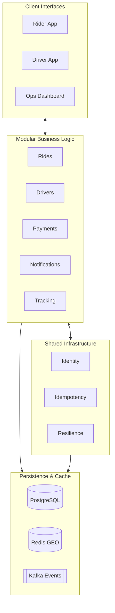

# Architecture Overview

The platform uses a Micro-Modular Monolith pattern. This approach provides clear service boundaries while maintaining deployment simplicity.

## System Map

## Core Functional Pillars

### 1. Real-time Core
Built on Django Channels and Redis Sub/Pub for sub-second synchronization. Every state change triggers a **Triple-Broadcast** (via `apps.rides.services.lifecycle.update_ride_status`) to Rider, Driver, and Admin interfaces.

### 2. Algorithmic Matching
The engine filters candidates based on:
- **Proximity**: 10km radius via Redis GEO.
- **Trust Score**: Behavioral history.
- **Driver Level**: Ranking from PRO to NORMAL.

### 3. Financial Integrity
The Payments module enforces a strict double-entry ledger. All transactions are immutable, ensuring a perfect audit trail for every ride.

## Data Strategy

| Store | Data Type | Usage |
| :--- | :--- | :--- |
| Kafka | Streams | Global Event Bus (`ride_events`). Primary used for the `RIDE_SEARCHING` firehose for background matching and archival tracking. |
| PostgreSQL | Entities | Authoritative storage for Users, Rides (Status: `OFFERED`, `ONGOING`, etc.), Financial Ledger, and Support Tickets. |
| Redis GEO | Spatial | High-frequency Driver GPS tracking and proximity-based candidate search. |
| Redis KV | Ephemeral | Distributed locks (dispatch protection), OTP storage, rate-limit counters, and session metadata. |

## Scalability & Resilience

- **Distributed Locking**: Using Redis to prevent double-assignments.
- **Load Shedding**: Throttling during extreme demand.
- **Circuit Breakers**: Isolation for external APIs (Google, Razorpay).
- **Idempotency**: Unified prevention of duplicate requests.
