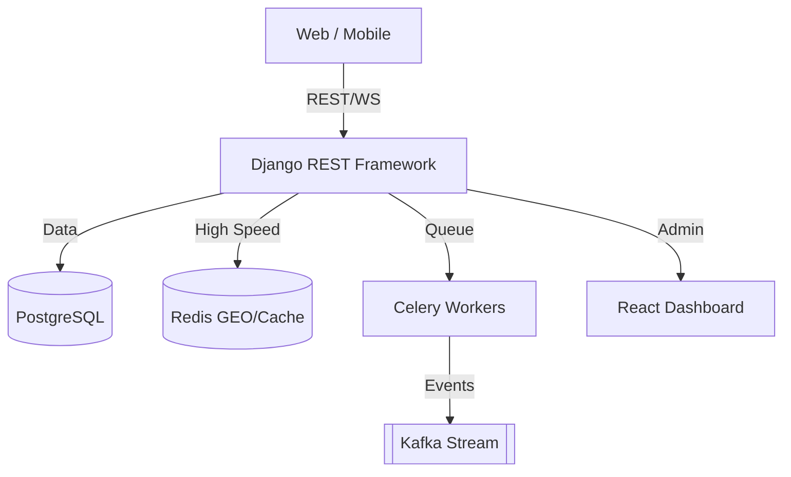

## Stack Overview

## Backend Infrastructure

- **Language**: Python 3.9+
- **Framework**: [Django](https://www.djangoproject.com/) (Backend core) & [Django REST Framework](https://www.django-rest-framework.org/) (REST API).
- **Real-time Layer**: [Django Channels](https://channels.readthedocs.io/en/stable/) (WebSockets using Redis Channels layer).
- **Database**: [PostgreSQL](https://www.postgresql.org/) (Persistent storage, ACID compliant).
- **Caching / GEO / Lock**: [Redis](https://redis.io/) (High-speed proximity search, distributed locks, ephemeral state).
- **Asynchronous Tasks**: [Celery](https://docs.celeryproject.org/en/stable/) with [Redis](https://redis.io/) as a broker.
- **Message Broker**: [Kafka](https://kafka.apache.org/) (Used for high-volume event streaming and analytics).

## Frontend Layer

- **Web Apps**: [Next.js](https://nextjs.org/) / [React](https://reactjs.org/) (Admin Dashboard, Admin Map).
- **Mobile Apps**: [React Native](https://reactnative.dev/) (Rider and Driver applications).
- **State Management**: [Redux](https://redux.js.org/) / [Context API](https://reactjs.org/docs/context.html).
- **Maps Middleware**: [Google Maps Platform](https://developers.google.com/maps) (Directions, Places, Geocoding, and Dynamic Maps).

## Observability & Monitoring

- **Metrics**: [Prometheus](https://prometheus.io/) (Scraping application and system metrics).
- **Visualization**: [Grafana](https://grafana.com/) (Real-time dashboards for revenue, success rates, and latency).
- **Logging**: Python `logging` with structured output for log aggregation.
- **Auditing**: Built-in Django models for ledger entries and triple-entry reconciliation.

## DevOps & Deployment

- **Environment**: [Docker](https://www.docker.com/) & [Docker Compose](https://docs.docker.com/compose/) (Containerized development and deployment).
- **Web Server**: [NGINX](https://www.nginx.com/) (Reverse proxy and static file serving).
- **Process Manager**: [Gunicorn](https://gunicorn.org/) (WSGI/ASGI server).
