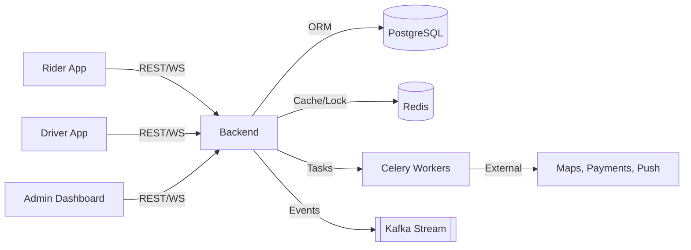

# Data Flow

How information travels through the system during high-value actions.

## System Data Flow

## Key Real-time Points
- **WebSockets**: Every state change (CANCELLED, COMPLETED) is broadcast to all three clients.
- **GPS Snapping**: Driver pings are processed and streamed to the rider map instantly.
- **Ledger Audit**: Financial entries are created only after the ride enters the `COMPLETED` state.