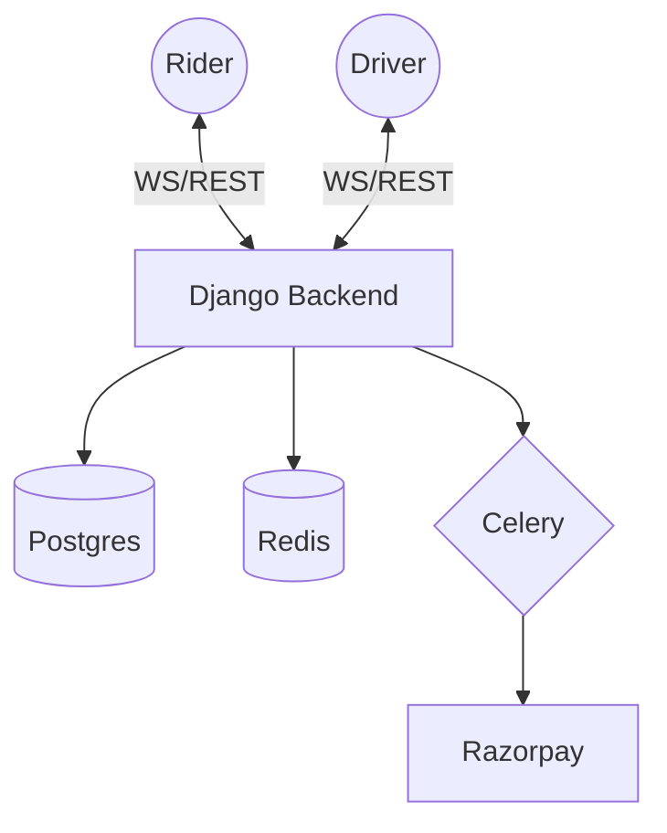

# System Design: Uber Clone

This section documents the high-level architecture and system design of the Uber Clone platform, focusing on scalability, real-time communication, and reliability.

## Sections Overview

- [**0. Overview**](./0.Overview.md): Project goals and core value propositions.
- [**1. Architecture**](./1.Architecture.md): Micro-modular monolithic architecture and component interaction.
- [**2. Tech Stack**](./2.Tech_Stack.md): Comprehensive list of languages, frameworks, and infrastructure tools.
- [**3. Data Flow**](./3.Data_Flow.md): How data travels through the system during critical events.
- [**4. Setup & Dependencies**](./4.Setup_and_Dependencies.md): Setup guide, dependencies, and Docker management.
- [**5. Scaling**](./5.Scaling.md): Strategies for handling 10k+ concurrent users.

## Key Architectural Pillars

- **Real-time Core**: Utilizing WebSockets (Django Channels) and Redis for sub-second updates.
- **Micro-Modular Monolith**: A single codebase with clearly defined, decoupled apps (Rides, Payments, Drivers, etc.).
- **Server-Authoritative State Machine**: Every ride transition is validated by the server to prevent fraud and logical errors.
- **Triple-Entry Financials**: Every transaction is matched with ledger entries and audits to ensure $0 gap.
- **Observability-First**: Built-in Prometheus metrics and Grafana dashboards for monitoring business health in real-time.
