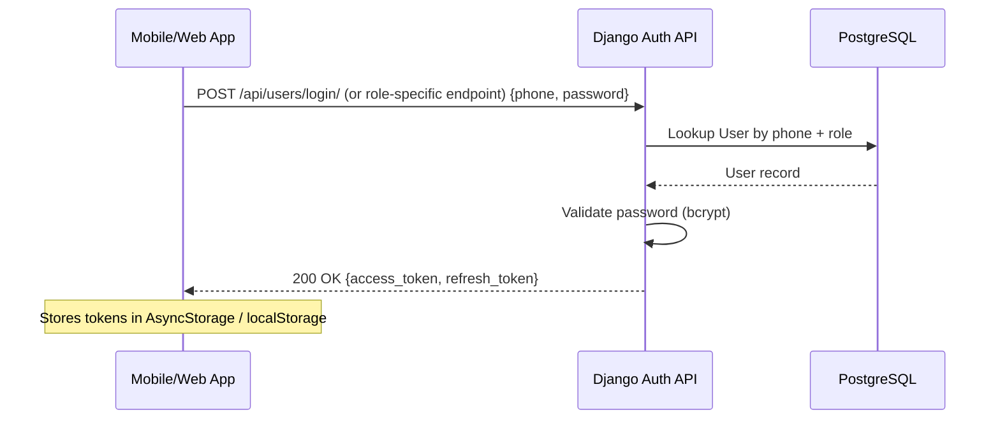

# Workflow: User Login

The login workflow is a secure sequence that verifies a user's identity and issues a set of JWT tokens for stateless session management.

## The Login Sequence

This sequence is initiated via a POST request to one of the role-specific login endpoints:

1. **Request Login**:
- Riders use `POST /api/users/login/`.
- Drivers use `POST /api/users/driver-login/`.
- Admins use `POST /api/users/admin-login/`.
2. **Input Verification**:
- The API server verifies the provided phone number (or username) exists.
- The password is checked against the encrypted hash stored in PostgreSQL.
3. **Role Verification**:
- The system ensures the user's `role` on their `User` record matches the specific login view being used (e.g., a `rider` cannot login through the `DriverLoginView`).
4. **Token Issuance**:
- A new JWT pair (`access` + `refresh`) is generated using `SimpleJWT`.
- The tokens contain the `user_id` and the user's **Role**.
5. **Audit Log**:
- A successful login event is recorded in the system logs for security monitoring.

## The Client Experience

Upon a successful login, the client receives:
- **JWT Access Token**: To be included in the `Authorization` header for all future requests.
- **JWT Refresh Token**: To be stored securely for access token rotation.
- **User Profile Metadata**: Minimal data (name, email, role, phone) to hydrate the app's UI.

## Error Handling: Security Failures

- **Invalid Credentials**: A `400 Bad Request` or `401 Unauthorized` status is returned with a generic"Incorrect phone number or password"message.
- **Inactive Account**: If a user's account is suspended, the login is rejected with a descriptive error.
- **Rate Limiting**: Multiple failed login attempts trigger an automated lockout logic to prevent brute-force attacks.
---

## Flow Diagram

