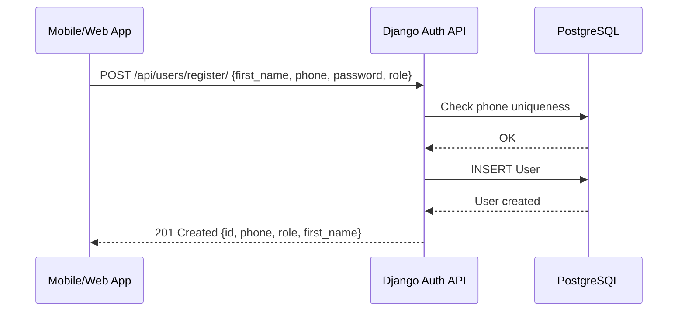

# Workflow: User Registration (Signup)

The user registration workflow is a straightforward sequence that moves a new user from"onboarding"to"identity created."

## The Registration Sequence

This sequence is triggered via `POST /api/users/register/` and follows these steps:

1. **Request Login**: The client (mobile/web) POSTs their phone number, password, name, and desired **Role** (`rider` or `driver`).
2. **Validation**:
- The API server ensures the phone number and username are unique.
- The password is encrypted using a one-way cryptographic hash (e.g., Argon2 or PBKDF2).
3. **User Creation**:
- A new `User` record is created in PostgreSQL with the specified `role`.
- If the role is `rider`, a corresponding `RiderStats` record is automatically initialized.
4. **Welcome Outreach**:
- A"Welcome to Uber Clone!"email is dispatched through an asynchronous notification worker (Celery).
5. **Audit**:
- If an email is provided, a `WELCOME_EMAIL` notification record is logged.

## The User Identity Lifecycle

Upon successful registration:
- **No Automatic Login**: The user is typically redirected to the login screen to provide their credentials and obtain their first JWT token pair.
- **Security Protocol**: No sensitive data (e.g., password hashes) is returned in the API response.

## Future Enhancements

- **Two-Factor Authentication (2FA)**: Implementing SMS-based OTP verification before the account is fully activated.
- **Social Onboarding**: Allowing users to sign up via Google/Facebook/Apple for a faster experience.
- **KYC (Know Your Customer)**: Requiring drivers to upload identity documents (ID/License) for manual approval before they can accept rides.
---

## Flow Diagram

