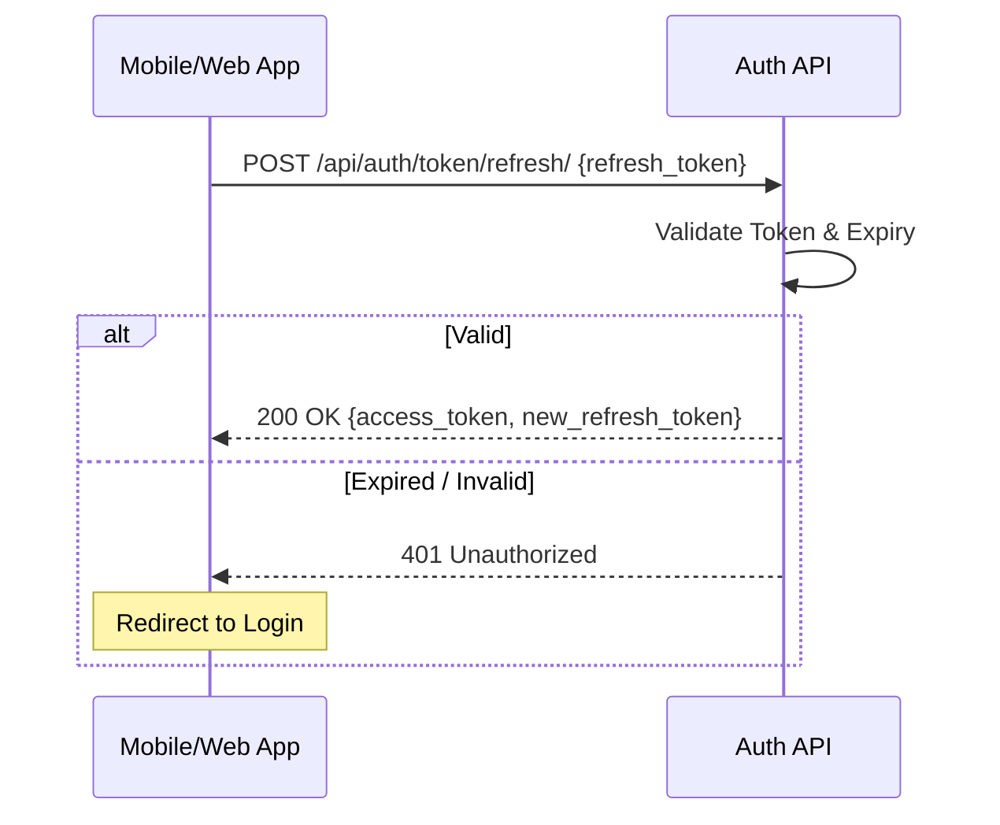

# Workflow: Token Refresh

The token refresh workflow is a stateless process that allows a client to obtain a new access token without requiring the user to re-enter their credentials.

## The Refresh Sequence

This sequence is initiated via `POST /api/users/token/refresh/` and typically occurs when the client's `access_token` is rejected with a `401 Unauthorized` status.

1. **Request Token**: The client POSTs their stored `refresh_token` to the token refresh endpoint.
2. **Verification**:
- The `SimpleJWT` middleware validates the signature and expiration of the refresh token.
- The middleware ensures the token has not been blacklisted.
3. **New Token Issuance**:
- A new, short-lived `access_token` is generated for the authenticated user.
- Depending on configuration, a new `refresh_token` may also be issued (sliding window).
4. **Issue Response**: The response includes the new token(s) for the client to use.

## The Client Experience

Upon a successful refresh:
- **No User Visibility**: The refresh typically happens automatically in the background (via a network interceptor or axios middleware).
- **Session Continuity**: The user is not logged out, and their active session (e.g., a tracking map or ride history) is maintained.

## Error Handling: Terminal Expire

If the `refresh_token` is also expired or invalid:
- **Standard Status**: `401 Unauthorized`.
- **Client Action**: The client must clear all stored credentials and redirect the user to the log-in screen.
- **Security Protocol**: Expired refresh tokens are unusable, necessitating a fresh authentication flow.

---

## Flow Diagram

