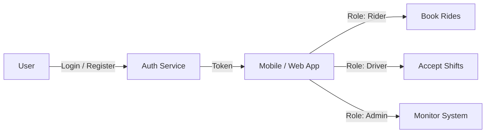

# Users & Authentication

This module manages user identity, roles, and secure access across the Uber Clone ecosystem. It supports multiple user types (Riders, Drivers, Admins) and utilizes industry-standard token-based authentication.

## Sections Overview

- [**0. Overview**](./0.Overview/Introduction.md): Introduction to the authentication system and user roles.
- [**1. Architecture**](./1.Architecture/System_Design.md): System design, role separation, and security protocols.
- [**2. API**](./2.API/Endpoints.md): REST endpoints for registration, login, and profile management.
- [**3. Database**](./3.Database/Models.md): Deep dive into the custom `User` and `RiderStats` models.
- [**4. Core Logic**](./4.Core_Logic/JWT_System.md): Details on the JWT system and custom permissions.
- [**5. Workflows**](./5.Workflows/Login.md): Step-by-step guides for signup, login, and token refresh.
- [**6. Edge Cases**](./6.Edge_Cases/Invalid_Token.md): Handling security anomalies and rate limiting.

## Key Features

- **Custom User Model**: Extends Django's `AbstractUser` with phone numbers and explicit roles.
- **JWT-Based Auth**: Utilizes `SimpleJWT` for stateless, secure session management.
- **Role-Based Access Control (RBAC)**: Strict permissioning for Riders, Drivers, Operators, and Admins.
- **Push Notification Integration**: Tracks `expo_push_token` for real-time mobile notifications.
- **Rider Statistics**: Tracks rides and aggregate ratings for every rider.
