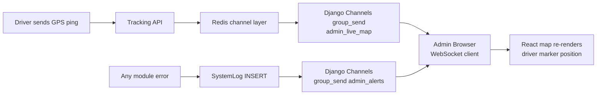

# Workflow: Real-time Platform Monitoring

The Monitoring workflow is an asynchronous sequence designed to provide sub-second visibility into ride-hailing performance across the platform.

## The Monitoring Sequence

### 1. Ingest initiation
- A core system event (e.g. `RIDE_CREATED`) triggers a call to the notification service: `send_alert(type, message, metadata)`.
- **Backend**: 
- Validates the metadata (e.g. `ride_id`, `driver_id`).
- Creates a `SystemLog` record with the corresponding payload and `type: INFO` or `WARNING`.

### 2. Dashboard Update
- An administrative user opens the Dashboard (`admin_live_map`).
- The backend broadcasts a high-priority alert event (`type: ride.booking.alert`) to the WebSocket group.
- **Rider Connection**: The Admin Dashboard React map shows a pulsing marker for the ride's pickup location.

### 3. Asynchronous Broadcast
- The system pushes the event into the `admin_live_map` group in **Django Channels**.
- The Admin Dashboard (Browser) receives the `driver.location.update` message.

### 4. Admin Finality
- Admin reviews the alert, views the detailed metadata (e.g. GPS snapshot), and determines if manual intervention is needed.
- **Resolution**: Administrative users are informed of the alert's `RESOLVED` status via an in-app banner for safety.

## The User Experience (Monitoring)

While of a support inquiry:
- **Live Monitor**: Map-centric view of active operations (Drivers, Rides, SOS).
- **Management Portals**: CRUD interfaces for Users, Drivers, Payments, and Offers.
- **System Health**: Firehose for `SystemLog` (Alerts) to catch and fix technical issues in real-time.
---

## Flow Diagram

