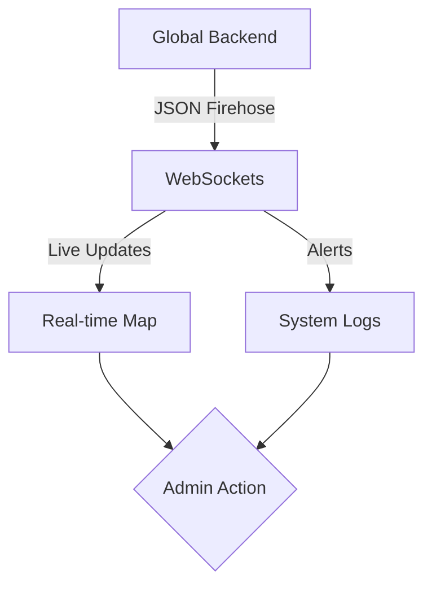

# Admin Dashboard Module

The Admin Dashboard is the nerve center of the Uber Clone, providing real-time visibility and control over rides, drivers, payments, and system health.

## Directory Structure

- [**0. Overview**](./0.Overview/Introduction.md): High-level introduction to the internal monitoring and management tool.
- [**1. Architecture**](./1.Architecture/System_Design.md): System design, real-time firehose, and dashboard components.
- [**2. API**](./2.API/Endpoints.md): API endpoints for live map, statistics, and system alerts.
- [**3. Database**](./3.Database/Models.md): Deep dive into the `SystemLog` (System Alerts) model.
- [**4. Core Logic**](./4.Core_Logic/Live_Map.md):
- [Live Map Updates](./4.Core_Logic/Live_Map.md)
- [System Alerts](./4.Core_Logic/Alerts.md)
- [**5. Workflows**](./5.Workflows/Monitoring_Flow.md): Step-by-step sequence of real-time monitoring.
- [**6. Edge Cases**](./6.Edge_Cases/Data_Lag.md): Handling WebSocket disconnections and high-load data delays.

## Key Features

- **Live Tracking Map**: Real-time visualization of all online drivers and active rides via WebSockets.
- **System Alerts Firehose**: Automated logging and display of critical errors (e.g. payment failures, stuck rides).
- **Aggregate Analytics**: High-level summaries of revenue, active drivers, and platform health.
- **Drill-Down Control**: Ability to view detailed history for any rider, driver, or ride directly from the map.
- **WebSocket Synchronization**: Sub-second latency for location updates and system notifications.
- **Admin Permissions**: Restricted access to sensitive financial and user-personal data.
