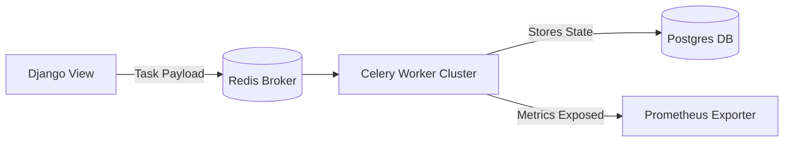

# Async Task Flow

This document details how asynchronous tasks are orchestrated using Docker, Celery, and Redis within the Common Core module, including health check monitoring.

## 1. System Health Monitoring

The Common Core runs periodic (Celery Beat) checks through `apps.common.tasks.update_system_health` every 30 seconds.

### **Health Check Stages**:
1. **PostgreSQL Validation**:
    - Queries a simple `select 1` from the main DB engine.
2. **Redis Validation**:
    - Evaluates connection viability using standard `ping`.
3. **Kafka Streaming Component Validation**:
    - Ensures event bus is reachable (when applicable/configured).
4. **Cache/Storage Write Test**:
    - Modifies the centralized `cache.set('system_health_status')`.

## 2. Asynchronous Job Processing (Background Queue)

Whenever a module needs to offload heavy calculations or non-blocking logic (emails, extensive ledger queries, map routing):

1. **Producer Side**:
    - App emits `.delay()` or `.apply_async()`.
    - Message securely dispatched to Redis acting as standard Broker (`redis:6379/0`).

2. **Consumer Side (Celery Worker)**:
    - Worker node actively listening unqueues the action representation.
    - Code is evaluated.
    - Result dynamically returned via RPC or maintained within `django_celery_results`.

