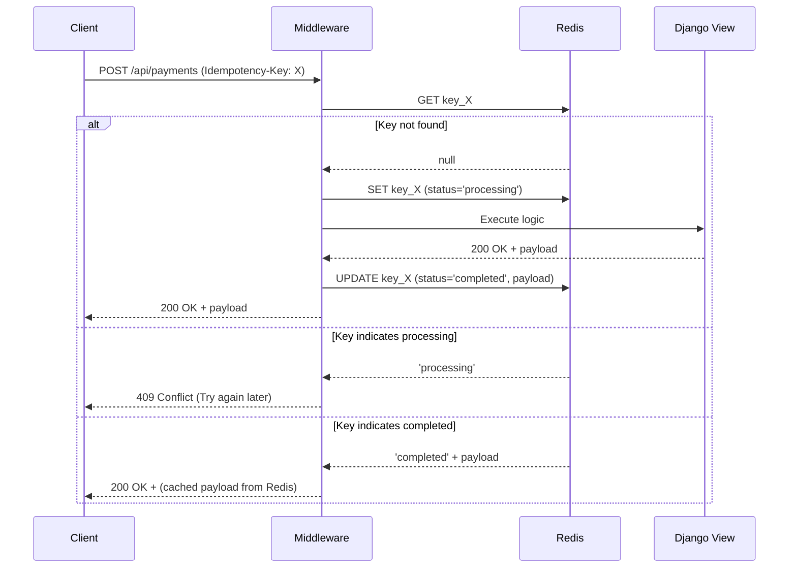

# Idempotency Execution Workflow

This workflow describes how API idempotency is enforced in the Common Core module, particularly for mutually exclusive actions (like processing a payment or accepting a ride).

## 1. Request Interception
1. Client makes an HTTP POST/PUT/PATCH request.
2. The client must include an `Idempotency-Key` header (usually a UUID4).
3. The request hits the `IdempotencyMiddleware` or the `@idempotent` decorator.

## 2. Key Validation & Locking
1. The system extracts the `Idempotency-Key`.
2. A Redis check is performed using `{prefix}:idempotency_key:{key}`.
3. If the key exists:
   - The system checks the `status`.
   - If `status == 'processing'`, it immediately returns a `409 Conflict` (Duplicate request in progress).
   - If `status == 'completed'`, it retrieves the serialized JSON response from Redis and returns it to the client without hitting the database.
4. If the key does not exist:
   - Redis sets the key with `status == 'processing'` and a TTL (e.g., 24 hours).

## 3. Execution & Storage
1. The actual Django view or Celery task executes the business logic.
2. If execution succeeds:
   - The response status code and JSON payload are captured.
   - Redis updates the key to `status == 'completed'` and stores the exact HTTP response payload.
3. If execution fails (e.g., Exception/500):
   - The `Idempotency-Key` is deleted entirely from Redis, allowing the client to safely retry the request.

## Diagram

