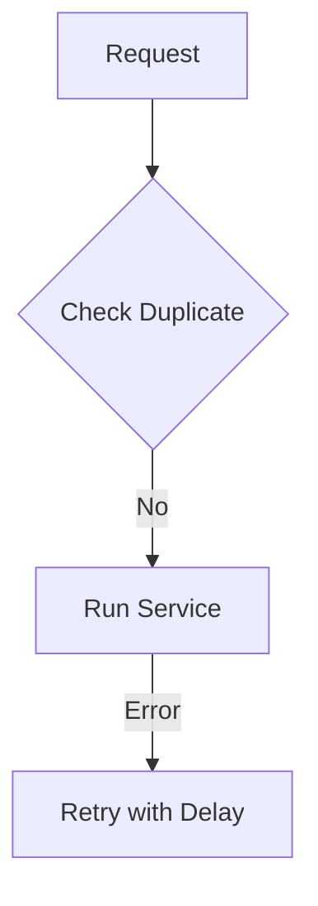

# Common Core

The foundation for reliability, security, and background processing.

## Shortcuts
- [Overview](./0.Overview/Introduction.md)
- [Resilience](./1.Architecture/System_Design.md)
- [Idempotency](./2.Idempotency/Idempotency_Design.md)
- [Fraud Engine](./3.Fraud/Fraud_Detection.md)
- [Logging & Sentry](./4.Logging_Monitoring/Overview.md)
- [Async Tasks](./5.Async_Processing/Overview.md)

---

## Key Strategies

### 1. Rate Limiting & Abuse Protection
The platform uses a custom **Redis-based Middleware** to protect sensitive endpoints (Login, Ride Request, OTP Verification).

- **Precision**: Unlike IP-based limiters, we prioritize the **JWT `user_id` claim**. This prevents blocking multiple different users who might share a single IP (e.g. mobile carrier NAT or a corporate Nginx).
- **Graceful Fallback**: If no JWT is present, the system falls back to the `X-Forwarded-For` header.
- **Rules**:
    - `POST /api/users/login/`: 5 attempts per minute.
    - `POST /api/rides/request/`: 5 creations per minute.
    - `POST /api/payments/`: 10 calls per minute.

### 2. The Idempotency Guard
Mutation tasks use the `@idempotent_task` decorator to ensure that repeated requests for the same operation have the same effect as a single request. This is crucial for reliability and preventing unintended side effects, especially in distributed systems or when dealing with unreliable network conditions.

### 3. Reliability & Resilience
The system incorporates mechanisms like retries and circuit breakers to handle transient failures gracefully, ensuring high availability and a robust user experience.

### 4. Fraud Detection
Advanced algorithms are employed to detect and prevent fraudulent activities, such as GPS spoofing and payment abuse, safeguarding both users and the platform.

### 5. Audit & Reconciliation
Periodic financial reconciliation processes are in place to ensure data accuracy and maintain the integrity of all transactions.
