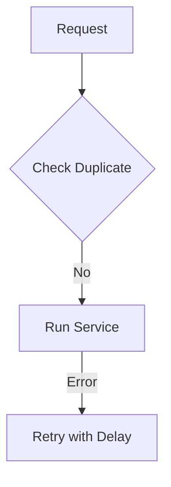

# Common Core

The foundation for reliability, security, and background processing.

## Shortcuts
- [Overview](./0.Overview/Introduction.md)
- [Resilience](./1.Architecture/System_Design.md)
- [Idempotency](./2.Idempotency/Idempotency_Design.md)
- [Fraud Engine](./3.Fraud/Fraud_Detection.md)
- [Logging](./4.Logging_Monitoring/Logging.md)
- [Async Tasks](./5.Async_Processing/Celery.md)

## Key Points
- **Reliability**: Uses retries and circuit breakers to handle failures.
- **Security**: Prevents double-requests with idempotency keys.
- **Fraud**: Detects GPS spoofing and payment abuse.
- **Audit**: Periodic financial reconciliation ensures accuracy.
