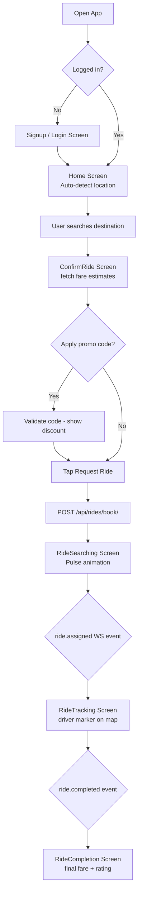

# Workflow: Mobile Ride Booking Flow

The Mobile Ride Booking workflow is a real-time, multi-step sequence designed to deliver a seamless journey from intent to driver assignment in the Rider App.

## The Booking Sequence

### 1. Intent & Destination
- The user opens the `Home` screen.
- **Pickup**: Automatically set based on the `LocationService` pings.
- **Dropoff**: User searches via the `DestinationSearch` component (Google Places Autocomplete).

### 2. Configuration & Estemation
- The user is navigated to the `ConfirmRide` screen.
- **Backend Call**: Fetch fare estimates and ETAs for all vehicle types.
- **User Action**: Select vehicle type, apply promo code, and choose payment method.

### 3. Request Initiation
- User clicks **"Request UberGo"**.
- **State Commit**: A `Ride` record is created in the backend in `SEARCHING` status.
- **UI Feedback**: Transition to the `RideSearching` screen with pulse animations.

### 4. Matching & Assignment
- The [**Matching Engine**](../../3.Rides/4.Core_Logic/Matching_Engine.md) in the backend finds a driver.
- **Notification**: The app receives a WebSocket or Push event: `ride.assigned`.
- **UI Sync**: Display Driver name, vehicle model, and OTP code.

### 5. Transition to Tracking
- The app successfully subscribes to the `ride_{id}` WebSocket.
- Navigation auto-switches to the `RideTracking` screen for live progress monitoring.

## The User Experience

While searching/waiting:
- **Animated Pulse**: Visual feedback that the system is looking for a driver.
- **Cancellation Control**: Clear, high-latency-protected button to stop the request before a driver accepts.
- **ETA Countdown**: Real-time update of when the driver is expected to arrive at the pickup point.

## Atomic Transitions (Status Changes)

The workflow handles several state transitions:
- **Assigned**: Transition from pulse animation to active driver card.
- **Arrived**: Display"Driver has Arrived"banner and highlight the pickup location.
- **Completed**: Transition to the rating and receipt screen after trip finish.
---

## Flow Diagram

