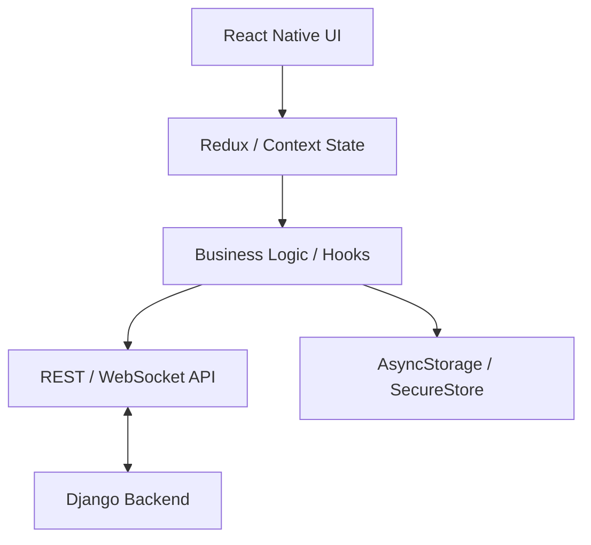

# Rider App (Mobile)

The Rider App is a cross-platform mobile application built with React Native and Expo, providing riders with a seamless interface for booking rides, tracking drivers, and managing payments.

## Directory Structure

- [**0. Overview**](./0.Overview/Introduction.md): High-level introduction to the mobile rider experience.
- [**1. Architecture**](./1.Architecture/System_Design.md): System design, app structure, and key technologies.
- [**2. Navigation**](./2.Navigation/Structure.md): Deep dive into the screen hierarchy and navigation flow.
- [**3. State Management**](./3.State_Management/Providers.md): Application-wide state handling (Auth, Ride, Location).
- [**4. Components**](./4.Components/Core_Library.md): Core UI components and reusable design elements.
- [**5. Services**](./5.Services/API_Clients.md): Backend API integration, WebSockets, and Location services.
- [**6. Workflows**](./6.Workflows/Ride_Booking_Flow.md): End-to-end mobile user journeys.

## Key Features

- **Real-time Map Integration**: Interactive maps using `react-native-maps` for pickup/dropoff selection.
- **Smart Search**: Destination searching powered by Google Places Autocomplete.
- **Live Ride Tracking**: Sub-second synchronization with driver location via WebSockets.
- **In-app Payments**: Secure payment gateway integration with Razorpay.
- **Push Notifications**: Instant alerts for ride assignment, arrival, and completion.
- **Support & Safety**: Integrated SOS button and support ticket management.
- **Promotions**: Seamless application of offer codes and discount visualization.
