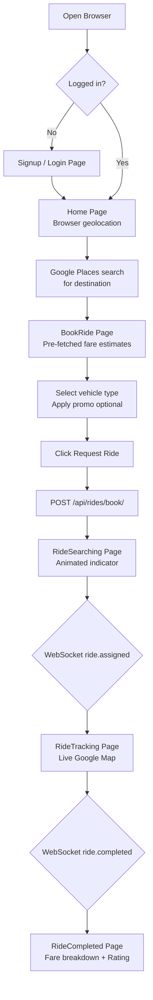

# Workflow: Web Ride Booking Flow

The Web Ride Booking workflow is a multi-step, real-time sequence designed to deliver a seamless journey from intent to driver assignment in the Rider Web platform.

## The Booking Sequence

### 1. Intent & Destination
- The user opens the `Home` page.
- **Pickup**: Automatically resolved from the browser's Geolocation API.
- **Dropoff**: User searches via the Google Places Autocomplete search bar.

### 2. Configuration & Estimation
- The user is navigated to the `BookRide` page.
- **Backend Call**: Fetch fare estimates and ETAs for all vehicle types from `GET /api/rides/estimate/`.
- **User Action**: Select vehicle type, apply promo code, and choose payment method.

### 3. Request Initiation
- User clicks **"Request Ride"**.
- **State Commit**: A `Ride` record is created in the backend in `SEARCHING` status.
- **UI Feedback**: Transition to the `RideSearching` page with animated matching indicator.

### 4. Matching & Assignment
- The [**Matching Engine**](../../3.Rides/4.Core_Logic/Matching_Engine.md) finds a driver.
- **Notification**: The web app receives a WebSocket event: `ride.assigned`.
- **UI Sync**: Display Driver name, vehicle model, and OTP.

### 5. Transition to Tracking
- The app subscribes to the `ride_{id}` WebSocket channel.
- React Router auto-navigates to the `RideTracking` page for live progress monitoring.

### 6. Completion
- After trip end, the backend emits `ride.completed`.
- React Router navigates to `RideCompleted` page showing fare breakdown, tip options, and rating form.

## The User Experience

- **Animated Waiting Screen**: Visual progress indicator with a"Searching for nearby drivers…"message.
- **Cancel Control**: Prominent, easy-access cancellation button during the SEARCHING phase.
- **Live Map**: As soon as a driver is assigned, the map zooms to show the driver's current position moving towards pickup.
---

## Flow Diagram

