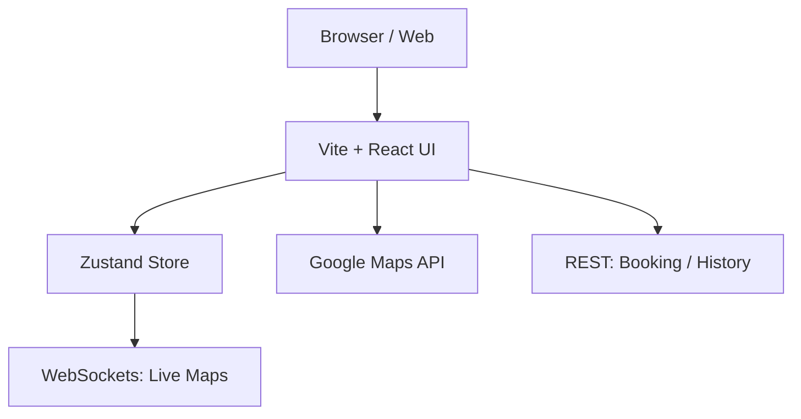

# Rider Web (Platform)

The Rider Web application is a modern, high-performance web interface built with React and Vite, providing riders with a comprehensive portal for ride booking, history, and support.

## Directory Structure

- [**0. Overview**](./0.Overview/Introduction.md): High-level introduction to the rider web experience.
- [**1. Architecture**](./1.Architecture/System_Design.md): System design, app structure, and key technologies.
- [**2. Navigation**](./2.Navigation/Structure.md): Deep dive into the screen hierarchy and navigation flow.
- [**3. State Management**](./3.State_Management/Zustand.md): Application-wide state handling with Zustand.
- [**4. Components**](./4.Components/Core_Library.md): Core UI components and reusable design elements.
- [**5. Services**](./5.Services/API_Clients.md): Backend API integration, WebSockets, and Maps services.
- [**6. Workflows**](./6.Workflows/Web_Booking_Flow.md): End-to-end web user journeys.

## Key Features

- **High-Performance Map Visualization**: Integrated `react-google-maps/api` for pickup/dropoff selection and live tracking.
- **Modern Responsive Design**: Optimized for desktop and larger browser windows with a clean, Uber-style interface.
- **Global Store (Zustand)**: Lightweight, reactive state management across all booking steps.
- **Real-time Map Integration**: Sub-second synchronization with active trip status via WebSockets.
- **Analytics & History**: Comprehensive ride history visualization with interactive charts using `Recharts`.
- **Support Portal**: Detailed ticket history and integrated SOS/emergency signaling.
- **Promotions & Offers**: Integrated banner system for active discounts and coupon application.
