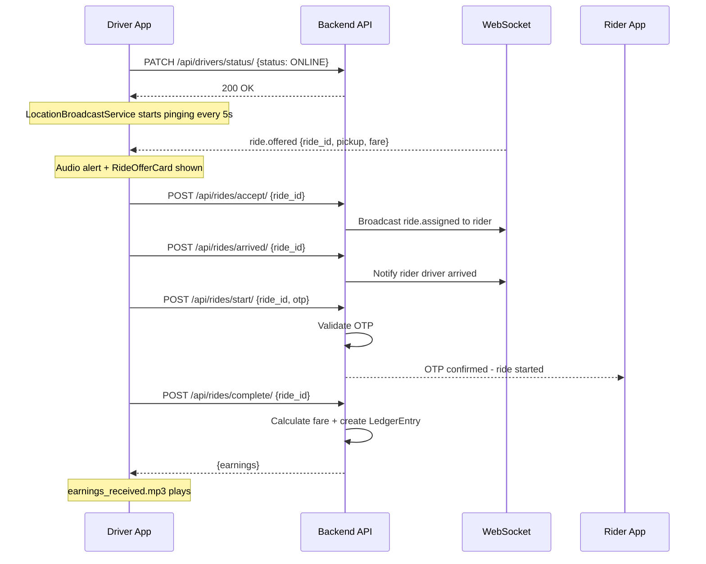

# Workflow: Ride Fulfillment Flow

The Ride Fulfillment workflow covers the complete operational lifecycle that a driver experiences from receiving a ride offer through to earning settlement — the core recurring loop of the Driver App.

## The Fulfillment Sequence

### 1. Going Online
- Driver taps the **Online Toggle** on the Home screen.
- `useShiftStore.setOnline(true)` is dispatched.
- `LocationBroadcastService.start()` begins pinging every 5 seconds.
- Backend marks `Driver.status = ONLINE` and the driver appears on the Admin Live Map.

### 2. Receiving a Ride Offer
- The backend [**Matching Engine**](../../3.Rides/4.Core_Logic/Matching_Engine.md) selects the driver.
- A `ride.offered` WebSocket event arrives on the `driver_{id}` channel.
- **Audio Alert**: `new_ride.mp3` plays at full volume (even if phone is on silent, if configured).
- **UI Interrupt**: `RideOfferCard` takes over the screen with a 15-second countdown timer.

### 3. Accepting the Offer
- Driver taps **Accept**.
- `RideService.acceptRide(rideId)` is called → Backend transitions ride to `ASSIGNED`.
- Navigation auto-moves to **RideTracking** screen with the pickup point loaded.

### 4. Navigating to Pickup
- Map centers on the **pickup location** with the route polyline rendered.
- Driver arrives → Taps **"I've Arrived"**.
- `RideService.markArrived(rideId)` → Backend transitions ride to `DRIVER_ARRIVED`.
- Rider is notified via push notification.

### 5. OTP Verification & Trip Start
- Driver asks rider for the 4-digit **OTP** displayed in the Rider App.
- Driver enters OTP into `OTPVerificationPanel`.
- `RideService.startRide(rideId, otp)` → Backend validates OTP and transitions ride to `ONGOING`.
- Map destination switches from pickup → **dropoff location**.

### 6. Trip Execution
- `LocationBroadcastService` continues streaming pings.
- Backend snaps coordinates to route, accumulates `actual_distance_km`, and broadcasts position to the rider.
- Driver follows turn-by-turn route and arrives at dropoff.

### 7. Trip Completion
- Driver taps **"Complete Ride"**.
- `RideService.completeRide(rideId)` → Backend transitions to `COMPLETED`:
- Final fare is calculated.
- `LedgerEntry` is created for the driver's earnings.
- Fraud checks run asynchronously.
- **Earnings notification**: `earnings_received.mp3` plays, and `EarningsCard` updates.
- Navigation returns to the Home map; driver is `ONLINE` for the next offer.

## The Driver Experience

- **Timeout & Auto-Reject**: If the driver does not respond to the `RideOfferCard` within the countdown, the offer is automatically rejected and the backend marks the attempt.
- **Cancellation Handling**: If the rider cancels after acceptance, a `ride.cancelled` WebSocket event triggers `cancelled.mp3` and navigates back to the Home screen.
- **Fraud Alert**: If fraud signals are detected post-completion, the driver receives an in-app warning and the trust score deduction is reflected on the Profile screen.
---

## Flow Diagram

