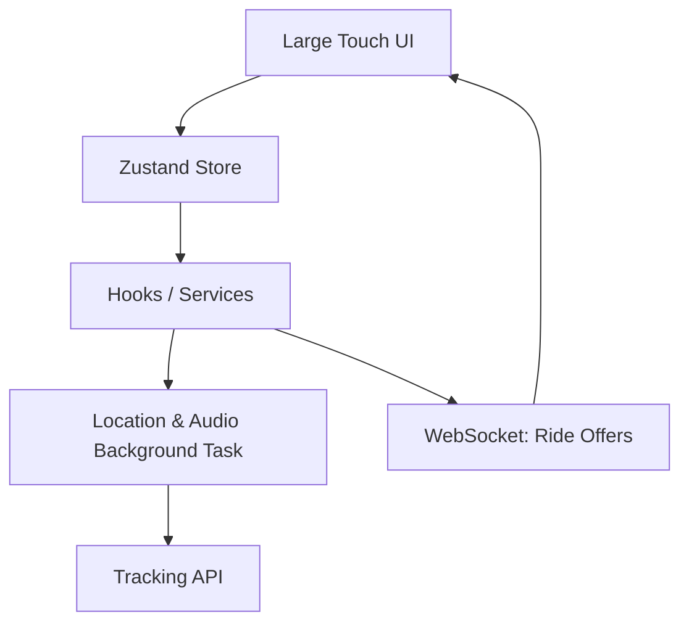

# Driver App (Mobile)

The Driver App is a robust, cross-platform mobile application built with React Native and Expo, providing drivers with the tools they need to manage their shift, accept rides, navigate routes, and track their earnings.

## Directory Structure

- [**0. Overview**](./0.Overview/Introduction.md): High-level introduction to the driver mobile experience.
- [**1. Architecture**](./1.Architecture/System_Design.md): System design, app structure, and key background technologies.
- [**2. Navigation**](./2.Navigation/Structure.md): Deep dive into the screen hierarchy and shift states.
- [**3. State Management**](./3.State_Management/Zustand.md): Application-wide state handling (Auth, Shift, Ride) with Zustand.
- [**4. Components**](./4.Components/Core_Library.md): Core UI components tailored for high visibility and fast interaction while driving.
- [**5. Services**](./5.Services/API_Clients.md): Backend API integration, WebSockets, Audio Alerts, and Background Location.
- [**6. Workflows**](./6.Workflows/Ride_Fulfillment_Flow.md): End-to-end driver journey from onboarding to ride completion.

## Key Features

- **Document Verification Flow**: Integrated `expo-image-picker` for fast and secure uploading of licenses and vehicle documents.
- **Audio Alerts & Notifications**: `expo-av` integration for loud, distinct ping sounds to ensure ride requests are never missed.
- **Background Location Sync**: `expo-location` used to stream high-frequency GPS coordinate pings to the backend `/api/tracking` module.
- **Optimized UI**: High-contrast, large-touch-target interface designed to be usable safely from a dashboard mount.
- **Real-time Map Navigation**: Moving map centering and polyline rendering for navigating to pickups and dropoffs.
- **Wallet & Payouts**: Real-time visibility into current ledger balances and instant withdrawal interfaces.
- **Incentives & Streaks**: Progress trackers for multi-ride bonuses to encourage longer shifts.
