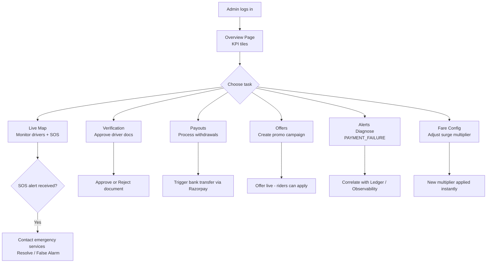

# Workflow: Core Admin Operations

This document covers the most critical day-to-day operational workflows performed by admins within the dashboard.
---

## 1. Monitoring the Live Map

**Scenario**: Operations manager monitoring platform activity during peak hours.

1. Admin navigates to **Live Map** (`/live-map`).
2. WebSocket connection is established — all `ONLINE` drivers appear as green markers.
3. Admin sees a **red pulsing marker** → SOS alert triggered by a rider.
4. A high-visibility modal appears with ride details, driver/rider contact info, and the GPS snapshot.
5. Admin contacts emergency services if needed, then clicks **Resolve Issue**.
6. A comprehensive **Resolution Modal** opens, allowing the admin to:
    - **Cancel Ride**: Forcibly terminate the ride for safety.
    - **Issue Refund**: Full or partial refund to the rider's ledger.
    - **Compensate Driver**: Add manual earnings for driver's time.
    - **Apply Penalty**: Deduct from driver's ledger for misconduct.
    - **Waive Fees**: Remove platform commission for the trip.
7. On confirmation, the backend triggers atomic ledger updates and the alert is dismissed.
---

## 2. Verifying a New Driver

**Scenario**: Driver Relations team reviewing the onboarding queue.

1. Admin navigates to **Verification** (`/drivers/verification`).
2. Table shows pending applications with uploaded document thumbnails.
3. Admin expands a row → full-resolution document images are shown.
4. Admin clicks **Approve** → `driversService.approveDocument(docId)` is called.
5. Backend transitions the `DriverDocument.status` to `APPROVED`.
6. If all documents are approved, the backend automatically activates the driver account.
---

## 3. Processing a Payout

**Scenario**: Finance team clearing the daily payout queue.

1. Admin navigates to **Payouts** (`/payments/payouts`).
2. Table lists all `PENDING` payout requests with requested amounts and bank account details.
3. Admin selects a payout → clicks **Process**.
4. `paymentsService.processPayout(payoutId)` is called.
5. Backend triggers the Celery payout task → status transitions `PENDING` → `PROCESSING` → `PAID`.
6. Driver receives a push notification confirming the withdrawal.
---

## 4. Launching a New Offer Campaign

**Scenario**: Marketing manager creating a weekend promo code.

1. Admin navigates to **Offers** (`/offers`).
2. Clicks **+ Create Offer**.
3. Fills in: `code: WEEKEND30`, `type: PERCENTAGE`, `value: 30`, `max_discount: 100`, `valid_from`, `valid_to`, `city: Chennai`.
4. Clicks **Save** → `offersService.create(payload)` is called.
5. Offer appears in the active list; riders in Chennai can immediately apply the code.
---

## 5. Diagnosing a System Alert

**Scenario**: Engineer sees a spike in `PAYMENT_FAILURE` alerts.

1. Admin navigates to **Alerts** (`/alerts`).
2. Filters by `type: PAYMENT_FAILURE` and the last 1 hour.
3. Reviews `metadata` JSONs in the alert rows for common patterns (e.g., same gateway error code).
4. Cross-references the affected `payment_id`s on the **Payments** page.
5. Navigates to **Observability** to check if the payment gateway circuit breaker has tripped.
6. Resolves the issue or escalates with the full audit trail from the Alerts and Ledger pages.
---

## 6. Adjusting Surge Pricing

**Scenario**: Operations manager responding to a supply shortfall during a storm.

1. Admin navigates to **Fare Config** (`/fare-config`).
2. Selects `City: Chennai`, `Vehicle: UberGo`.
3. Increases `surge_multiplier` from `1.0` to `1.8`.
4. Clicks **Save** → backend updates the pricing configuration immediately.
5. All new ride fare estimates in Chennai for UberGo will now reflect the 1.8× multiplier.
---

## Flow Diagram

