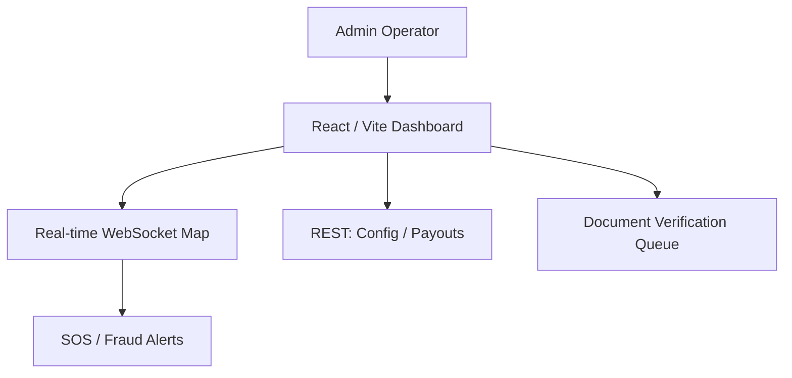

# Admin Dashboard Web

The Admin Dashboard is an internal React/Vite web application for platform operators. It provides a comprehensive, real-time operations centre covering live driver monitoring, payment ledgers, driver verification, offers management, and observability infrastructure.

## Directory Structure

- [**0. Overview**](./0.Overview/Introduction.md): High-level goals of the internal operations portal.
- [**1. Architecture**](./1.Architecture/System_Design.md): Tech stack, app structure, and WebSocket integration.
- [**2. Navigation**](./2.Navigation/Structure.md): Route hierarchy and role-based access control.
- [**3. Pages**](./3.Pages/Pages.md): Catalogue of every page and its operational purpose.
- [**4. Components**](./4.Components/Core_Library.md): Shared UI component library used across all pages.
- [**5. Services**](./5.Services/API_Clients.md): Backend REST and WebSocket clients.
- [**6. Workflows**](./6.Workflows/Ops_Flow.md): Core operational workflows from the admin's perspective.

## Key Features

- **Live Map (God's Eye View)**: All online drivers plotted in real-time via WebSocket with SOS alerts, ride overlays, and driver drill-downs.
- **Payments & Ledger Audit**: Full transaction history, payout management, and refund initiation via the internal ledger.
- **Driver Verification Queue**: Document review and approval workflow for onboarding new drivers.
- **Offers & Incentives Management**: CRUD interface for managing promotional campaigns and driver incentive rules.
- **Observability**: Integrated monitoring dashboards surfacing Prometheus metrics and system alert logs.
- **Reports & Analytics**: Charts powered by Recharts for revenue trends, ride volumes, and driver performance.
- **Fare Configuration**: Admin controls for base fare, per-km rates, surge multipliers, and city-level pricing.
