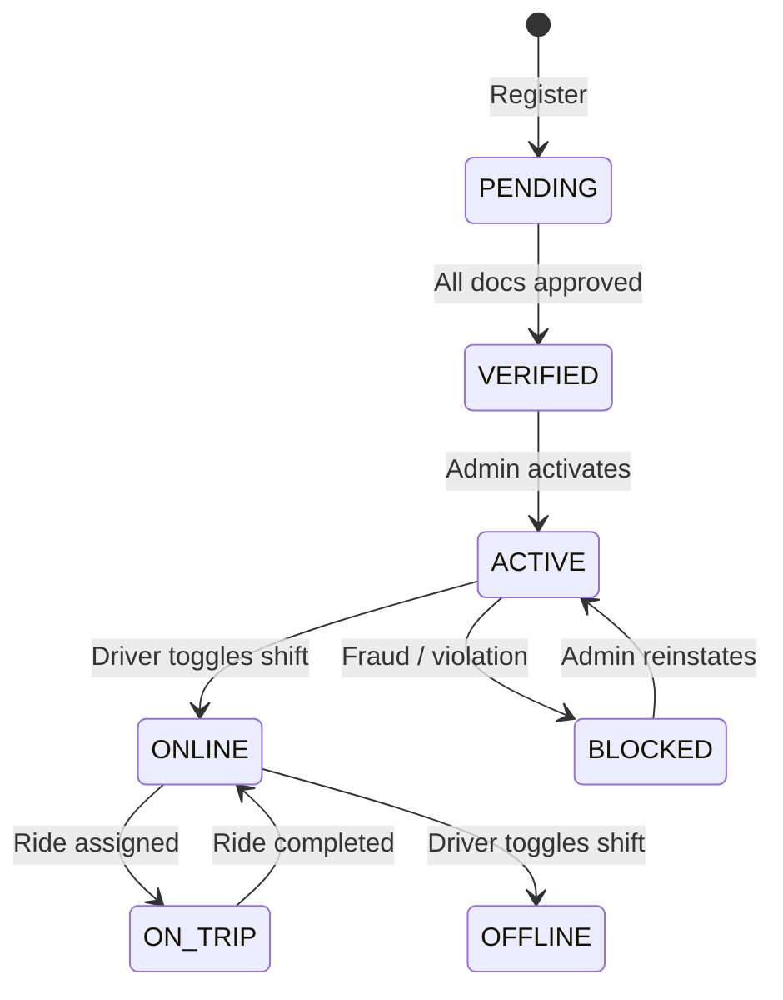

# Workflow: Driver Activation (Online/Offline)

Driver Activation is the process where a verified driver chooses to enter the marketplace to receive ride offers.

## The Activation Sequence

This flow is triggered via `PATCH /api/drivers/update-status/`.

### 1. Going `ONLINE`
1. **Verification Check**: System verifies `is_verified == True`.
2. **State Machine**: `transition_to(ONLINE)`.
3. **Redis Entry**: Driver's ID and current coordinates are added to the Redis `drivers_geo` set.
4. **Broadcast**: The Admin Live Map is updated to show a green (Online) icon for the driver.

### 2. Going `OFFLINE`
1. **State Machine**: `transition_to(OFFLINE)`.
2. **Redis Removal**: `ZREM` / `GEODEL` is called to remove the driver from the matching pool.
3. **Broadcast**: icon on the Admin Map is removed or greyed out.

## Barriers to Activation

A driver may be prevented from going `ONLINE` due to:
- **Unverified Documents**: If required documents are not yet approved.
- **Blocked Status**: If an admin has manually suspended the account for safety or fraud reasons.
- **Low Battery/Data (Client Side)**: The app prevents entering the pool if system resources are insufficient for reliable tracking.

## Heartbeats and Stale Pruning

To maintain marketplace reliability, the driver app sends a high-frequency"Heartbeat"(GPS ping):
- If no heartbeat is received for **30 seconds**, the Matching Engine automatically considers the driver"stale"and prunes them from the Redis GEO set.
- The driver would need to re-open the app or re-toggle `ONLINE` to enter the pool again.
---

## Flow Diagram

