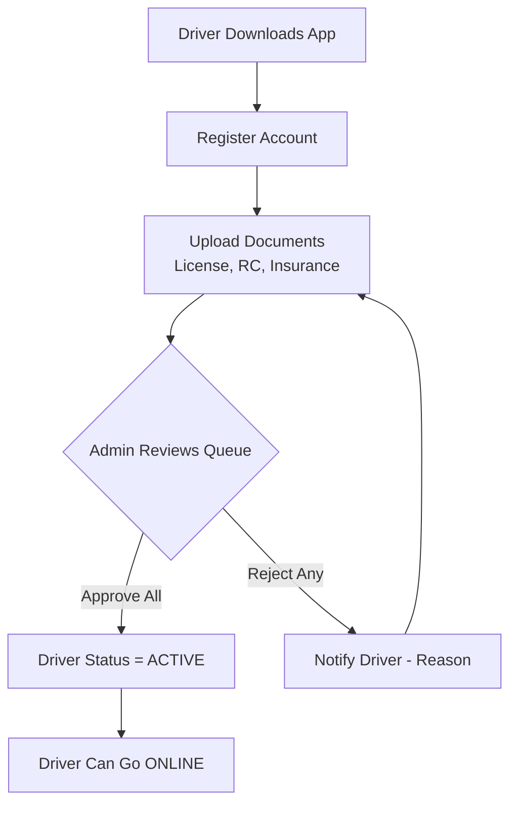

# Workflow: Driver Onboarding

The Driver Onboarding workflow is a multi-step sequence designed to convert a new user into a fully-vetted and active driver partner.

## The Onboarding Sequence

### 1. Account Creation
- User registers as a `driver` role.
- `Driver` profile is automatically initialized with `is_verified = False` and `status = OFFLINE`.

### 2. Profile Hydration
- Driver adds **Vehicle Details** (Model, Number).
- Driver adds **Bank Details** (Account number, IFSC) for automated payouts.

### 3. Document Submission
- Driver uploads high-resolution photos of:
- Driving License
- Registration Certificate (RC)
- Vehicle Insurance
- Documents are saved to storage and marked as `PENDING`.

### 4. Admin Review
- Admin reviews the documents on the Support Dashboard.
- Verification of image clarity and expiration dates.
- Transition: `PENDING` -> `APPROVED` (or `REJECTED`).

### 5. Final Activation
- Once the"Required Set"(License, RC, Insurance) is approved:
- System sets `is_verified = True`.
- Notification:"Congratulations! You can now go ONLINE."

## The Driver Experience

While onboarding:
- The driver app shows a"Verification Pending"checklist.
- Helpful tooltips guide the user through re-uploading rejected documents.
- The driver **cannot** enter the matching pool (cannot go `ONLINE`) until the final activation is complete.

## Document Rejection Protocol

If a document is rejected:
- `status` set to `REJECTED`.
- `rejection_reason` is captured by the admin.
- The driver receives a notification with the specific reason.
- The onboarding process is paused until a replacement document is uploaded and approved.
---

## Flow Diagram

