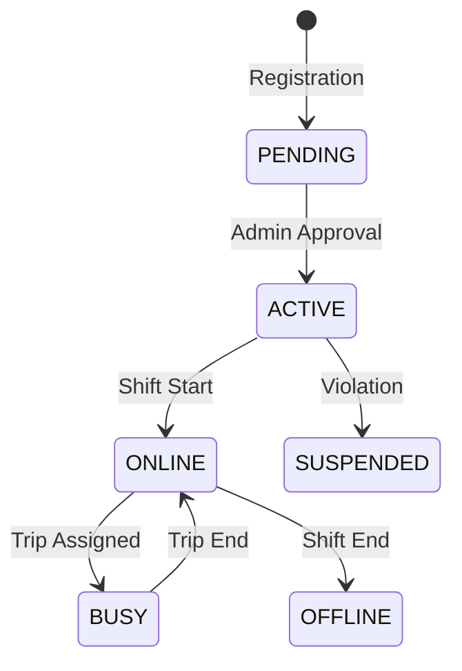

# Drivers Module

The Drivers module manages the lifecycle of driver partners, including onboarding, verification, and status management.

## Driver States

## Technical Shortcuts

| Category | Documentation Link |
| :--- | :--- |
| Logic | [Trust Scoring](./4.Core_Logic/Trust_Score.md) \| [Verification System](./4.Core_Logic/Driver_Verification.md) |
| Real-time | [Geo Location](./4.Core_Logic/Geo_Location.md) \| [Status Engine](./4.Core_Logic/Driver_Status.md) |
| Flows | [Onboarding Flow](./5.Workflows/Driver_Onboarding.md) \| [Activation Flow](./5.Workflows/Driver_Activation.md) |
| Safety | [Fraud Detection](./6.Edge_Cases/Fraud_Driver.md) \| [Background Tracking](../6.Tracking/Tracking_Readme.md) |

## Key Pillars

### Automated Verification
Multi-stage pipeline for License and Vehicle document review via the Admin verification queue.

### Redis-GEO Availability
Online drivers are indexed in Redis for sub-millisecond proximity queries within a 10km radius.

### Dynamic Ranking
Drivers progress through Normal, Active, Consistent, and PRO levels based on acceptance rates and ratings.

## Module Navigation
- [Models & Stats](./3.Database/Models.md)
- [API Endpoints](./2.API/Endpoints.md)
- [Verification Architecture](./1.Architecture/System_Design.md)
