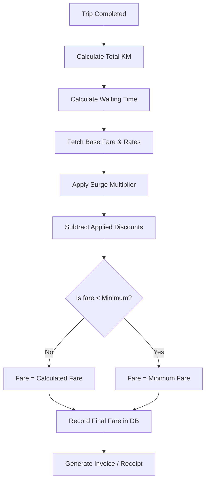

# Fare Calculation Logic

The system uses a dynamic fare engine that balances profitability for drivers with fairness for riders.

## Final Fare Formula

The authoritative final fare is calculated at the end of the trip using the following formula:

```
Final Fare = (Base Fare + (Actual Distance - Included KM) * KM Rate + Waiting Charge) * Surge Multiplier - Discount
```

### Components

- **Base Fare**: A flat fee per vehicle type (e.g., ₹59.00 for UberGo).
- **Included KM**: Distance already covered by the base fare (e.g., 2.00 km).
- **KM Rate**: Charge per extra kilometer (e.g., ₹18.00 per km for UberGo).
- **Waiting Charge**:
- First `N` minutes (e.g., 2 mins) are **FREE**.
- After that, a per-minute rate is applied (e.g., ₹2.00/min).
- **Surge Multiplier**: Dynamic multiplier (1.0x to 3.0x+) based on demand/supply, capped for stability.
- **Floor**: The system ensures a `minimum_fare` (e.g., ₹60.00) is always met.

## Price-Shock Prevention

To maintain rider trust, the system implements a **Price Shock Cap**:
- A rider is never charged more than **1.5x** their original estimated quote.
- *Exception*: This cap is bypassed if the `actual_distance_km` exceeds the `planned_distance_km` by more than **20%** (i.e., the rider changed their route significantly or added mid-ride stops).

## Auditability (Fare Breakdown)

Upon ride completion, the system takes an immutable **Fare Breakdown Snapshot**. This snapshot is stored as JSON and used for receipts and the Trip History view:

```json
{
"base_fare":"59.00",
"distance_charge":"216.00",
"waiting_charge":"15.00",
"surge_multiplier":"1.2",
"subtotal":"348.00",
"discount_amount":"50.00",
"final_fare":"298.00"
}
```

## Administration

Admins can configure these rates per vehicle type (moto, auto, go, xl) via the **Fare Configuration API**. Updates are cached for 60 seconds to ensure high-performance lookups.

---

## Flow Diagram



