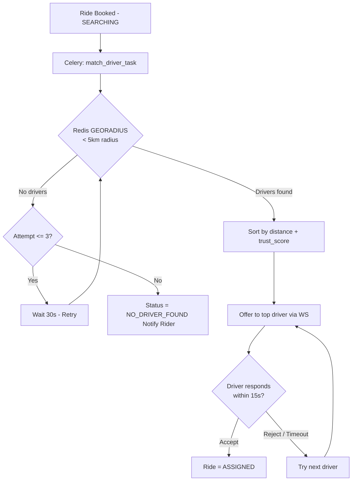

# Matching Engine Configuration

The matching engine is a multi-step search service designed to provide the most suitable driver for a ride request while ensuring global supply/demand balance.

## The Search Process

When a ride request is made, the engine performs the following:

1. **Nearby Search**: Finds all online drivers within a **10 km radius** (using Redis GEO).
2. **Exclusion**: Removes drivers who are already busy (`status=BUSY`) or who have already rejected the specific ride request.
3. **Prioritization**: Loads all remaining candidates and sorts them based on:
- **Driver Level**: `PRO` (4) > `CONSISTENT` (3) > `ACTIVE` (2) > `NORMAL` (1).
- **Trust Score**: Higher scores (e.g., 90+) are prioritized.
- **Proximity**: Preserves the geo-distance order from the initial search.

## Matching Logic & Contention

To handle high concurrency (10k+ concurrent users), the matching worker uses:

- **`select_for_update(skip_locked=True)`**: This allows multiple workers to concurrently evaluate different drivers without blocking each other.
- **Sequential Offering**: If a driver rejects or times out (60 seconds), the engine automatically offers the ride to the next best candidate.

## Driver Penalty: Auto-Assign

To prevent drivers from cherry-picking trips and leaving riders stranded:
- Each driver's daily rejections are tracked.
- If a driver rejects **3 rides** in a single day, their next ride offer is **Auto-Assigned** (`status=ASSIGNED` immediately).
- This auto-assignment count is reset daily.

## Matching Events

All matching steps are broadcast in real-time:
- **Driver App**: Receives a `ride_offer` event (with a 60-second countdown).
- **Rider App**: Receives `RIDE_OFFERED` status updates as the engine cycles through candidates.
- **Admin Dashboard**: Shows all"candidate driver IDs"considered during the search to help with system monitoring.
---

## Flow Diagram

