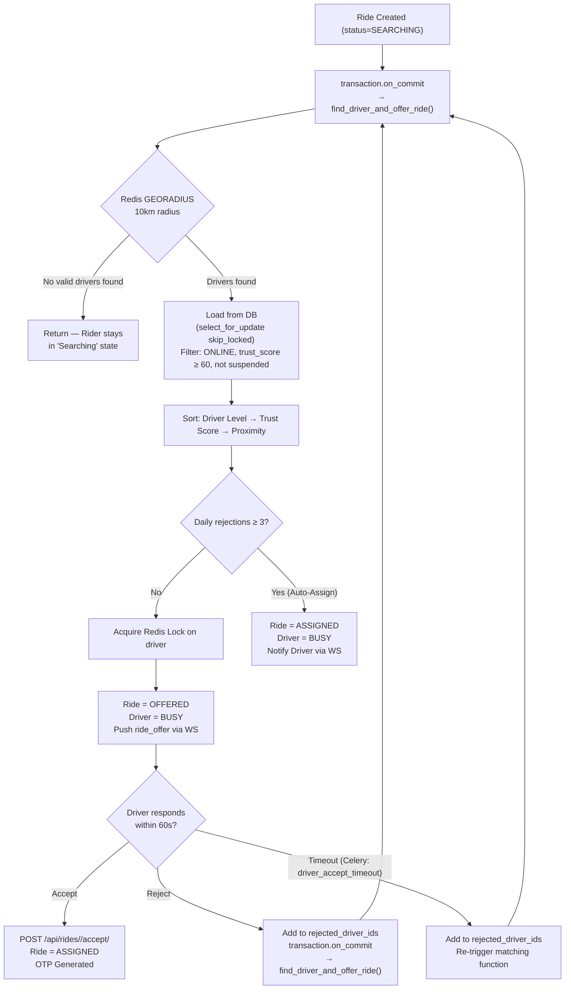

# Matching Engine Configuration

The matching engine is a multi-step search service designed to provide the most suitable driver for a ride request while ensuring global supply/demand balance.

## The Search Process

When a ride request is made, the engine performs the following:

1. **Nearby Search**: Finds all online drivers within a **10 km radius** (using Redis `GEORADIUS`).
2. **Exclusion**: Removes drivers who are already busy (`status=BUSY`) or who have already rejected the specific ride request.
3. **Prioritization**: Loads all remaining candidates and sorts them based on:
   - **Driver Level**: `PRO` (4) > `CONSISTENT` (3) > `ACTIVE` (2) > `NORMAL` (1).
   - **Trust Score**: Higher scores (≥ 60) are eligible. Suspended drivers are excluded.
   - **Proximity**: Preserves the geo-distance order from the initial Redis search.

## How the Engine is Triggered

The matching engine is **NOT** a Celery task. It is a direct Python function call
(`find_driver_and_offer_ride(ride_id)`) that is scheduled via Django's `transaction.on_commit()` hook.

**Why `transaction.on_commit`?**
- Guarantees the `Ride` record is fully committed to PostgreSQL before the matching engine reads it.
- Prevents a race condition where the engine starts looking for a driver before the ride row is visible to other DB connections.

When a driver **rejects** or **times out**, the engine re-triggers itself recursively in the same pattern:
- **Rejection**: `RejectRideView` calls `transaction.on_commit(lambda: find_driver_and_offer_ride(ride.id))`.
- **Timeout**: A `driver_accept_timeout` **Celery task** fires after 60 seconds, which re-triggers the matching function.

## Matching Logic & Contention

To handle high concurrency (10k+ concurrent users), the matching worker uses:

- **`select_for_update(skip_locked=True)`**: This allows multiple workers to concurrently evaluate different drivers without blocking each other.
- **Redis Distributed Lock (`lock_driver_for_offer`)**: Before assigning, the engine acquires a short-lived Redis lock on the chosen driver, preventing two rides from simultaneously offering to the same driver.
- **Sequential Offering**: If a driver rejects or times out (**60 seconds**), the engine automatically offers the ride to the next best candidate via a new `transaction.on_commit` call.

## Driver Penalty: Auto-Assign

To prevent drivers from cherry-picking trips and leaving riders stranded:
- Each driver's daily rejections are tracked via `DriverStats.rejection_count_today`.
- If a driver rejects **3 rides** in a single day, their next ride offer is **Auto-Assigned** (`status=ASSIGNED` immediately, skipping the `OFFERED` stage).
- The driver's status is simultaneously set to `BUSY`.
- This count resets daily.

## Matching Events

All matching steps are broadcast in real-time:
- **Driver App**: Receives a `ride_offer` WebSocket event (with a 60-second countdown timer).
- **Rider App**: Receives `RIDE_OFFERED` or `RIDE_ASSIGNED` status updates as the engine finds a match.
- **Admin Dashboard**: Receives `RIDE_STATUS_UPDATED` with the full list of `nearby_driver_ids` considered during the search.
---

## Flow Diagram

