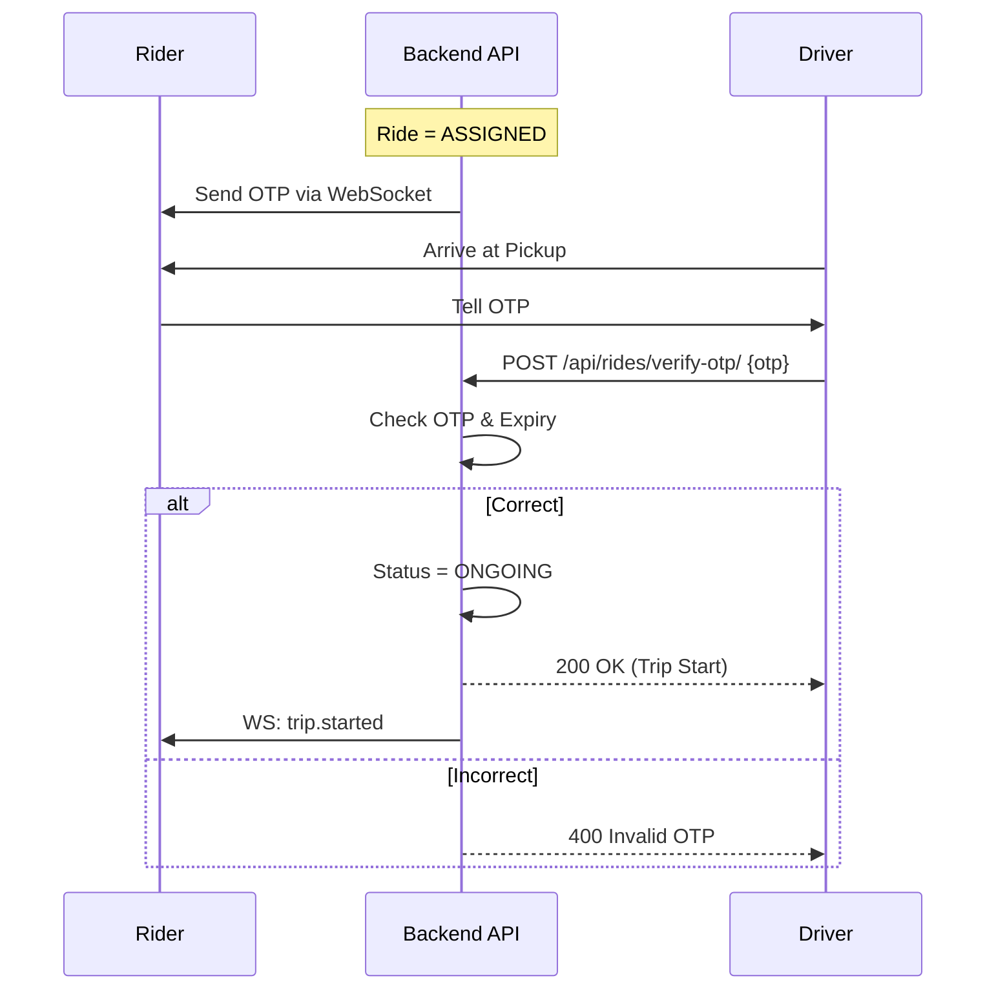

# OTP System: Ride Verification

The system uses a One-Time Password (OTP) verification system to ensure both Rider and Driver safety and to prevent"phantom trips."

## The OTP Workflow

The OTP is the"handshake"that officially transitions the ride from `ARRIVED` to `ONGOING`.

1. **Generation**: When a driver is successfully matched (`ASSIGNED`), the system generates a random 4-digit OTP (e.g., `1234`).
2. **Notification**: The OTP is sent immediately to the **Rider App** (via WebSocket and Push Notification).
3. **Expiry**: The OTP is valid for **5 minutes** from generation.
4. **Verification**:
- When the driver arrives at the pickup point (`ARRIVED`), they must ask the rider for the OTP.
- The driver submits the OTP via the **Driver App**.
- The system verifies the OTP against the stored record and current time.
5. **Audit Control**: Upon verification, the system:
- Locks the `otp_verified_at` timestamp.
- Locks the `start_time` for the trip (used for duration charges).
- Calculates and locks the `waiting_seconds` (the time the driver spent at the pickup).

## Security Features

- **State Restriction**: OTP is only available when the ride status is `ASSIGNED` or `ARRIVED`.
- **No Re-use**: Once an OTP is verified, it is cleared from the database to prevent replay attacks.
- **Limited Attempts**: Excessive failed OTP attempts are logged for fraud evaluation.
- **Expiry Control**: If the OTP expires, the driver must re-request it to ensure they are physically with the correct rider.

---

## Flow Diagram

