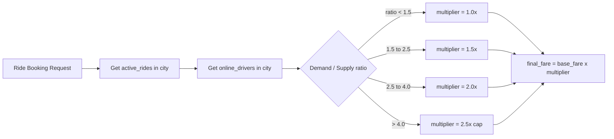

# Surge Pricing Engine

Surge pricing is an automated mechanism to balance supply and demand by adjusting fares during peak hours or in high-density areas.

## The Surge Logic

The surge multiplier is determined by two layers of configuration:

1. **Global Base Surge**: A baseline multiplier set by the Admin per vehicle type (default is `1.0x`).
2. **Dynamic Surge**: A Redis-cached multiplier calculated based on real-time activity in a specific geographic hex.

### How Multipliers are Applied

The system uses the following priority:
- **Highest Priority**: Dynamic surge from Redis (based on real-time demand).
- **Fallback**: Global base surge from the `FareConfig` database model.
- **Floor**: Always at least `1.0x`.
- **Ceiling**: Typically capped at `3.0x` to prevent extreme price shock.

## Dynamic Discovery

Surge multipliers are discovered during two critical moments:

1. **Fare Estimation**: When a rider searches for a ride, the system checks the surge for the pickup location to provide an accurate range.
2. **Final Fare Calculation**: The surge active **at the time of the ride request** is used for the final calculation.

## Stabilization: Surge Smoothing

The system implements"Surge Smoothing"to ensure a consistent experience:

- **Locking on Request**: Once a rider clicks"Request Ride,"the surge multiplier is locked for that specific `Ride` ID.
- **Anti-Jump Protection**: If wait times are high, the system prevents the multiplier from jumping more than `0.5x` in a 5-minute window, avoiding sudden price spikes while a user is looking at their phone.

## Administration

Admins can view active surge zones via the **Admin Dashboard Map Overlay**. This allows for manual intervention if the automated engine is reacting too aggressively to temporary traffic patterns.
---

## Flow Diagram

