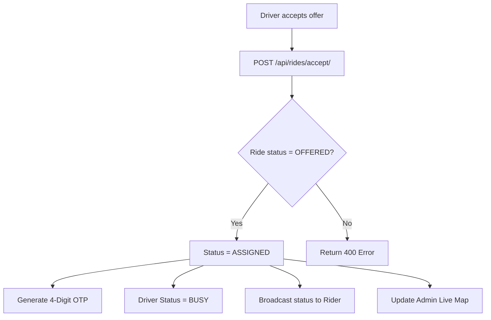

# Workflow: Driver Assignment

Driver assignment is the process of selecting a driver from the matching engine's candidates and officially transitioning the ride back into a"matched"state.

## The Assignment Sequence

This workflow is triggered when a driver responds to a ride offer.

### 1. Driver Acceptance (`POST /api/rides/<id>/accept/`)
- **Locking**: The system checks if the ride is still available (`status=OFFERED`).
- **FSM Transition**: `OFFERED` -> `ASSIGNED`.
- **Driver Status Update**: The driver's status is set to `BUSY`.
- **OTP Generation**: A unique 4-digit OTP code is generated for the rider's verification.
- **Broadcast**:
- **Rider**: Receives `RIDE_ASSIGNED` with the driver's name, rating, and vehicle photo.
- **Driver**: Receives confirmation that they are assigned and should begin navigation.
- **Admin**: Shows the assignment on the live map.

### 2. Auto-Assignment (Penalty)
- If a driver's daily rejections reach **3**, the system automatically skips the `OFFERED` stage for their next ride offer.
- **FSM Transition**: `SEARCHING` -> `ASSIGNED` immediately.
- **Notification**: The driver receives a push notification:"You have been auto-assigned a ride due to low acceptance rate."

## The Driver Navigation Flow

Once assigned, the driver moves through these stages:

1. **Navigating to Pickup**: The driver app initiates Google Maps navigation to the `pickup_lat/lng`.
2. **Arriving**: Upon reaching the geofence (200m radius), the driver clicks **"I have arrived."**
- `POST /api/rides/<id>/arrived/`.
- `status`: `ASSIGNED` -> `ARRIVED`.
- `arrived_at`: Timestamp is locked.
- **Rider Notification**:"Your driver has arrived! Please meet them at the pickup location."
3. **Waiting**: The driver waits for the rider and asks for the OTP.

## Error Handling: Driver Timeout

If a driver does not accept an offer within **60 seconds**:
- The offer is automatically revoked.
- `driver_accept_timeout` background task is executed.
- The driver is added to the ride's `rejected_driver_ids`.
- The matching engine is re-triggered to find the next candidate.

---

## Flow Diagram

