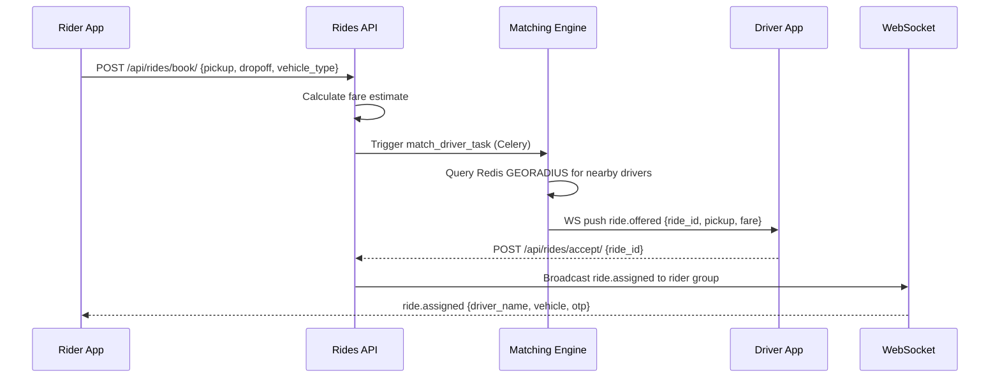

# Workflow: Ride Booking

The ride booking workflow is a mission-critical sequence that moves a Rider from"request"to"matched."

## The Booking Sequence

The flow is initiated via `POST /api/rides/request/` and follows these steps:

1. **Fare Estimation**:
- The system takes pickup/drop-off coordinates.
- Calls the Google Maps API for planned distance and time.
- Calculates the estimated fare based on the current `FareConfig` and any active `Surge`.
- Ranks the options by vehicle type (moto, go, xl).
2. **Ride Creation**:
- Once the rider confirms a type, a `Ride` record is created in the database.
- `status`: `SEARCHING`.
- `base_fare`: Stored as the authoritative estimated price for that trip.
3. **Matching Engine Activation**:
- The system immediately triggers the matching engine (asynchronously).
4. **Sequential Offering**:
- The matching engine finds the best online driver.
- Transition: `SEARCHING` -> `OFFERED`.
- The driver app receives a WebSocket event and shows an"Accept"button with a 60-second timer.

## Error Handling: No Drivers Found

If no drivers are found within the configured radius (10 km):
- The matching engine waits for a short retry interval.
- The `search_attempt` count on the `Ride` record is incremented.
- After 3-5 failed attempts, the rider is notified with an `ERROR_NO_DRIVER_FOUND` message.

## The Rider Experience (WebSocket)

The rider's app is kept in sync throughout the process:
- **Connecting**: Connecting to `ws/ride/<ride_id>/`.
- **Searching**: Showing a"Finding your driver"animation.
- **Matched**: Transitioning to"Driver is on the way"as soon as a driver accepts or is auto-assigned.
---

## Flow Diagram

