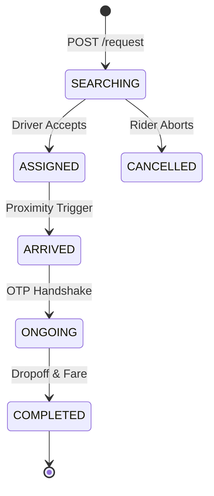

# Rides Module

The Rides module handles the complete lifecycle of a ride request, from initial estimation to driver matching, tracking, and final settlement.

## Ride Lifecycle

## Technical Shortcuts

| Category | Documentation Link |
| :--- | :--- |
| Logic | [Matching Engine](./4.Core_Logic/Matching_Engine.md) \| [Surge Pricing](./4.Core_Logic/Surge_Pricing.md) |
| Finance | [Fare Calculation](./4.Core_Logic/Fare_Calculation.md) \| [Ledger Settlement](../4.Payments/4.Core_Logic/Ledger_System.md) |
| Security | [OTP System](./4.Core_Logic/OTP_System.md) \| [Fraud Detection](./6.Edge_Cases/Cancellation.md) |
| Flows | [Booking Workflow](./5.Workflows/Ride_Booking.md) \| [Assignment Flow](./5.Workflows/Driver_Assignment.md) |

## Key Pillars

### Algorithmic Matching
Drivers are selected based on Proximity, Trust Score, and Fleet Ranking. The engine uses sequential offering for high conversion.

### Triple-Broadcast Sync
Status changes are mirrored across Rider App, Driver App, and Admin Map using WebSockets.

### Authoritative Fare Engine
Pricing uses a dynamic formula locked at the time of request to prevent price shock.

## Module Navigation
- [Models & Database](./3.Database/Models.md)
- [API Endpoints](./2.API/Endpoints.md)
- [Architecture Details](./1.Architecture/System_Design.md)
