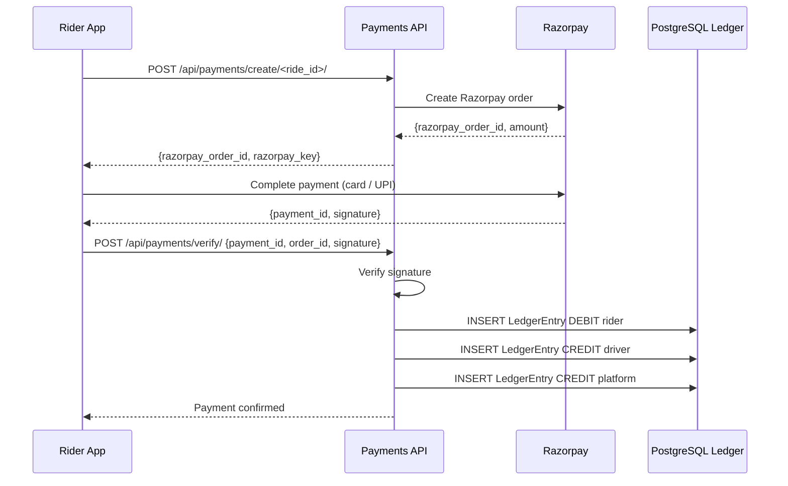

# Workflow: Rider Payment (Capture)

The Rider Payment workflow is a two-phase commit sequence that ensures funds are successfully authorized by the gateway before they are recorded in the internal ledger.

## The Payment Sequence

### 1. Initialization (`POST /api/payments/create/<ride_id>/`)
- Rider chooses a ride to pay for.
- **Backend**: 
- Calculates the authoritative ride fare (`final_fare`).
- Calls the gateway (e.g. Razorpay) to create an order.
- Creates a `Payment` record with `status: CREATED` and the `gateway_order_id`.
- **Response**: `gateway_order_id` is sent to the Rider's mobile app.

### 2. Authorization (Client-Side)
- Rider's mobile app opens the gateway UI (e.g., Razorpay modal).
- Rider enters payment details (Card/UPI/Netbanking).
- **Successful Auth**: The gateway returns a `gateway_payment_id` and `gateway_signature` to the app.

### 3. Verification & Capture (`POST /api/payments/verify/`)
- Mobile app POSTs the `razorpay_payment_id`, `razorpay_order_id`, and `razorpay_signature` to the backend.
- **Backend**: 
- Verifies the signature using the gateway's secret.
- Updates `Payment.status` to `COMPLETED`.
- Inserts the corresponding **LedgerEntry** (DEBIT) for the Rider and **Credit** for the Driver/Platform.

## The Rider Experience

While paying:
- The rider app shows a"Processing Payment"spinner.
- Upon success, a `PAYMENT_SUCCESS` push notification is sent.
- The ride history is updated to reflect the `PAID` status.

## Payment Rejection Protocol

If the gateway authorization fails (e.g.,"Insufficient Funds"):
- **Rider App**: Displays the specific error (if available).
- **Backend**: `Payment.status` set to `FAILED`.
- **Notification**: Rider is informed and can choose an alternative payment method.
---

## Flow Diagram

