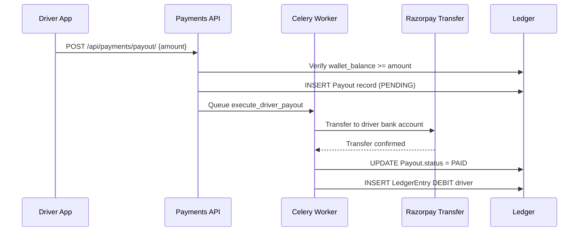

# Workflow: Driver Payout (Withdrawal)

The Driver Payout workflow is an asynchronous withdrawal sequence that ensures funds are successfully moved from the platform to the driver's bank account before they are debited from the internal ledger.

## The Payout Sequence

### 1. Request Initiation (`POST /api/payments/payout/`)
- Driver chooses an amount to withdraw (e.g., ₹1,000.00).
- **Backend**: 
- Calculates the driver's current balance from the `LedgerEntry` table. 
- Minimum and maximum withdrawal limits are enforced.
- Creates a `Payout` record with `status: REQUESTED` and a unique `reference`.
- **Response**: `reference` is sent to the Driver's mobile app.

### 2. Processing (Asynchronous)
- A Celery worker (`tasks.py`) picks up the `REQUESTED` payout.
- **Backend**: 
- Calls the integrated gateway's (e.g. Razorpay Payouts) API to initiate the movement of funds from the platform's bank account to the driver's.
- Updates `Payout.status` to `PROCESSING`.
- **Response**: Gateway returns a `gateway_payout_id`.

### 3. Terminal State (Success/Failure)
- **Success**:
- The gateway confirms the funds have reached the driver's bank account.
- `Payout.status` is updated to `PAID`.
- A `LedgerEntry` (DEBIT) for the withdrawal amount is inserted for the driver.
- **Failure**:
- The gateway returns a failure (e.g.,"Invalid Bank Account").
- `Payout.status` is updated to `FAILED`.
- `failure_reason` is captured, and the driver is notified. 

## The Driver Experience

While withdrawing:
- The driver app shows a"Payout Requested"card in their **Earnings** history.
- Upon success, a `PAYOUT_SUCCESS` push notification is sent.
- The total earnings balance is updated on the summary screen.

## Double-Withdrawal Guard

The system uses a **Postgres Row Lock** (`select_for_update`) on the driver's ledger summary during the initial request stage to prevent a driver from"racing"the API to withdraw more than their actual balance.
---

## Flow Diagram

