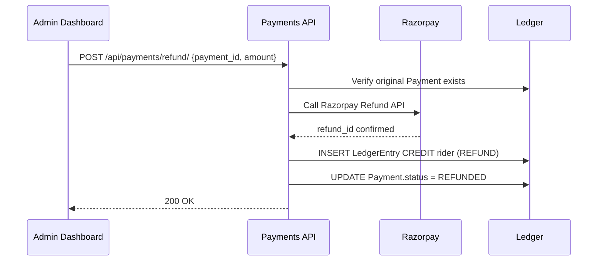

# Workflow: Payment Refund

The Payment Refund workflow is an asynchronous reversal sequence that ensures funds are successfully returned via the payment gateway before the internal ledger is adjusted.

## The Refund Sequence

### 1. Request Initiation (`POST /api/payments/refund/`)
- An Admin (or the Rider via support) chooses a `CAPTURED` payment for a specific ride to refund.
- **Backend**: 
- Verifies the `refundable_amount` (`amount - refunded_amount`).
- Ensures the refund is within policy limits (e.g. within 30 days).
- Creates a request in the internal `Refund` logic.
- **Response**: `refund_id` is sent to the Admin dashboard.

### 2. Processing (Asynchronous)
- A Celery worker (`tasks.py`) calls the integrated gateway's (e.g., Razorpay) `/refunds` API.
- **Backend**: 
- Gateway confirms the refund has been initiated.
- `Payment.refunded_amount` is incremented.
- `Payment.status` is updated to `PARTIALLY_REFUNDED` or `REFUNDED`.

### 3. Terminal State (Success/Failure)
- **Success**:
- A `LedgerEntry` (CREDIT) for the refund amount is inserted for the Rider.
- A corresponding `LedgerEntry` (DEBIT) for the Platform commission and Driver earnings is recorded (if applicable) to reverse the original credit.
- **Failure**:
- `failure_reason` is captured. The refund request is queued for manual support review.

## The Rider Experience

While a refund is processing:
- The rider app shows a"Refund Initiated"badge on the ride details screen.
- Upon completion, a `REFUND_SUCCESS` push notification is sent.
- Rider is informed that funds may take 5-7 business days to appear on their bank statement.

## Partial vs. Full Refund

- **Full Refund**: Reverses the entire ride fare.
- **Partial Refund**: For cases where a rider is compensated for a smaller issue (e.g., ₹50.00 refund on a ₹250.00 ride). The commission and driver earnings are recalculated and adjusted proportionally on the ledger.
---

## Flow Diagram

