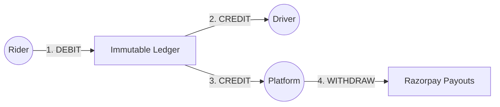

# Payments Module

The Payments module is the financial core of the platform, managing funds between Riders, Drivers, and the Platform treasury.

## Fund Flow

## Technical Shortcuts

| Category | Documentation Link |
| :--- | :--- |
| Accounting | [Ledger System](./4.Core_Logic/Ledger_System.md) \| [Wallet Logic](./4.Core_Logic/Wallet_System.md) |
| Operations | [Payout Management](./4.Core_Logic/Payout_System.md) \| [Refund Handling](./4.Core_Logic/Refund_System.md) |
| Resilience | [Idempotency](./6.Edge_Cases/Idempotency.md) \| [Webhooks](./4.Core_Logic/Webhooks.md) |
| Flows | [Payment Flow](./5.Workflows/Payment_Flow.md) \| [Payout Flow](./5.Workflows/Payout_Flow.md) |

## Key Pillars

### Immutable Ledger
Every event is a read-only LedgerEntry. We use Triple-Entry Accounting for every ride payment (rider debit, driver credit, platform credit).

### Idempotent Processing
Unique idempotency keys ensure network retries never result in double-charges or duplicate payouts.

### Automated Settlements
Integrated with Razorpay Transfer for daily earnings management and bank transfers.

## Module Navigation
- [Models](./3.Database/Models.md)
- [API Endpoints](./2.API/Endpoints.md)
- [Architecture](./1.Architecture/System_Design.md)
