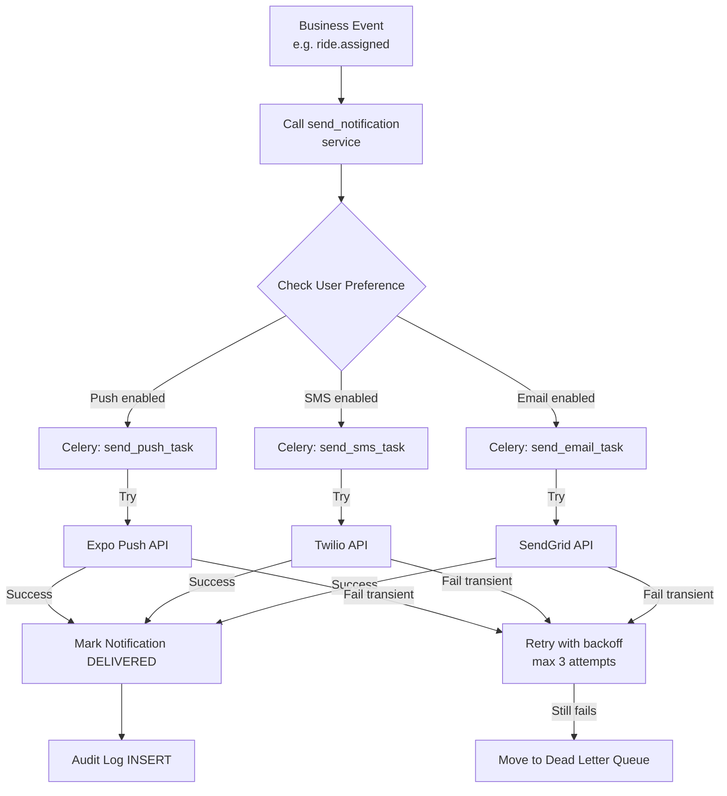

# Workflow: Notification Delivery

The Notification Delivery workflow is an asynchronous sequence designed to deliver real-time updates to riders, drivers, and admins via multiple channels.

## The Delivery Sequence

### 1. Event Initiation
- A core system event (e.g. `RIDE_CANCELLED`) triggers a call to the notification service: `send_notification(user, type, payload)`.

### 2. Dispatcher Rule Check
- The **Dispatcher** service first retrieves the recipient's `NotificationPreference` to see if the requested channel (e.g. `push`) is enabled.
- If enabled, the system creates a `Notification` database record with `status: PENDING`.

### 3. Asynchronous Task Trigger
- The `save()` method on the `Notification` model triggers an **Asynchronous Celery Task** (`deliver_notification.delay(id)`).
- This ensures that the main API request (e.g. ride cancellation) is not blocked by external network-bound delivery requests.

### 4. Channel Provider Execution
- The Celery worker picks up the task and calls the **Provider Factory**, which returns the specific provider (Expo, SendGrid, Twilio) required for that channel.
- The provider calls the external API.

### 5. Terminal State & Audit
- **Terminal State**: 
- **Success**: `Notification.status` updated to `SENT`.
- **Transient Failure**: Notification is re-queued for **Retry**.
- **Permanent Failure**: Notification moved to the **Dead Letter Queue (DLQ)**.

## The User Experience

While a notification is being delivered:
- **Live Experience**: For mobile users, the badge count is incremented on the icon.
- **Push Banner**: A push notification (with title/body) appears on the lock screen.
- **In-app Alert**: If the app is currently open, a banner or WebSocket flash message appears on the screen.

## Atomic Transactions (Reliability)

The system uses `transaction.on_commit` for all Celery task triggers. This ensures that the notification is **only** scheduled if the database transaction that created the ride status change (or event) is successfully committed.
---

## Flow Diagram

