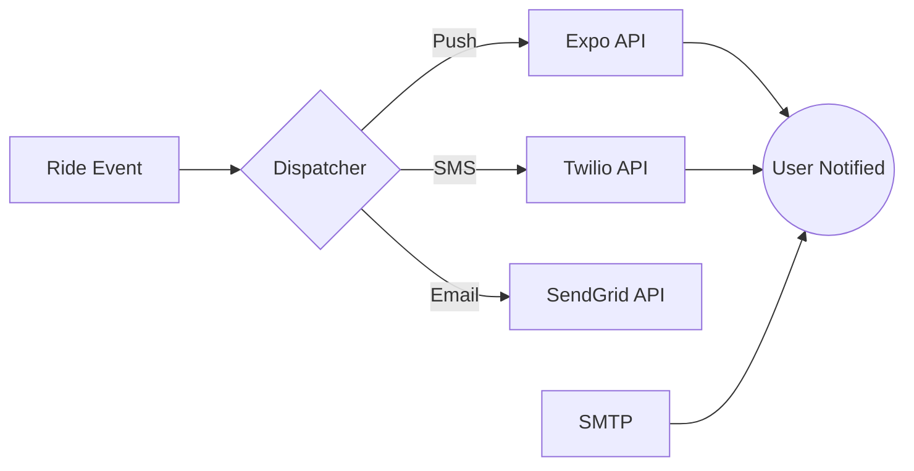

# Notifications Module

The Notifications module is the central communication hub of the Uber Clone, responsible for delivering real-time updates to riders, drivers, and admins via multiple channels.

## Directory Structure

- [**0. Overview**](./0.Overview/Introduction.md): High-level introduction to the multi-channel notification system.
- [**1. Architecture**](./1.Architecture/System_Design.md): System design, dispatcher logic, and asynchronous delivery.
- [**2. API**](./2.API/Endpoints.md): API endpoints for managing notification history and preferences.
- [**3. Database**](./3.Database/Models.md): Deep dive into `Notification`, `NotificationPreference`, and `NotificationDeadLetter`.
- [**4. Core Logic**](./4.Core_Logic/Dispatcher.md):
- [Dispatcher](./4.Core_Logic/Dispatcher.md)
- [Providers](./4.Core_Logic/Providers.md)
- [Retry Logic](./4.Core_Logic/Retry.md)
- [Dead Letter Queue (DLQ)](./4.Core_Logic/DLQ.md)
- [**5. Workflows**](./5.Workflows/Notification_Flow.md): Step-by-step sequence from event trigger to user device.
- [**6. Edge Cases**](./6.Edge_Cases/Delivery_Failure.md): Handling network outages, invalid tokens, and provider downtime.

## Key Features

- **Multi-Channel Support**: Logic for Push, SMS, and Email delivery.
- **Asynchronous Processing**: Every notification is dispatched via Celery to prevent blocking core business logic.
- **Persistent Audit Log**: Full history of sent, failed, and pending notifications with retry counts.
- **Intelligent Retry**: Exponential backoff for transient provider failures.
- **Dead Letter Queue**: Automated isolation of permanently failed notifications for manual admin review.
- **Preference Management**: Granular user control over which channels are used for specific event types.
