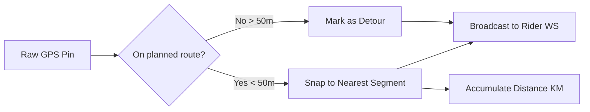

# Location Smoothing & Snapping Logic

The Smoothing system is responsible for converting raw, often noisy GPS pings from a mobile device into a clean, smooth visual representation of the driver on the map.

## The Snapping Concept

The system uses a **Snap-to-Polyline** algorithm to"pull"the raw GPS coordinate to the nearest segment of the `planned_route_polyline`.

### Purpose of Smoothing
- **No More Jitter**: Real GPS sensors have a small amount of"noise"that causes the driver's icon to jump or jitter around. Snapping fixes the icon to the road.
- **Accurate Distance**: Snapping ensures that the `actual_distance_km` is calculated along the road network rather than as a"straight line"across buildings.

## The Snapping Workflow

1. **Receive Ping**: (lat2, lng2).
2. **Retrieve Route**: The full `planned_route_polyline` for the ride.
3. **Calculation**: 
- Find the nearest segment (A-B) on the polyline to the raw coordinate.
- Project the coordinate onto that segment.
- **Snap**: Move the point to the resulting projected coordinate.
4. **Enforcement**: If the distance between the raw and snapped points exceeds $N$ meters (e.g. 50m), the point is **NOT** snapped (this handles legitimate detours).

## External Snapping (Google Roads API)

For high-precision needs, the system can be configured to use an **External Snapper**:

```python
def snap_to_roads(lat, lng):
# 1. Call Google Roads API: /snapToRoads
# 2. Receive the road-snapped point (latitude, longitude)
# 3. Return the corrected coordinate
```

- **Pros**: Perfectly matches the real-world road network.
- **Cons**: Higher cost and latency (API call per ping).

## Atomic Transitions (Database Integrity)

The system stores both the `last_lat/lng` (raw) and `last_snapped_lat/lng` (processed) on the `Driver` and `Ride` models. This allows for post-ride audits of"How much did the driver deviate from the planned path?".

---

## Flow Diagram



