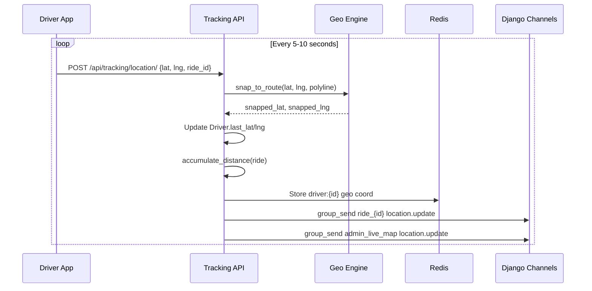

# Workflow: Live Ride Tracking

The Live Ride Tracking workflow is a real-time broadcast sequence that keeps the rider updated on the driver's exact position from the moment the ride is assigned until it is completed.

## The Tracking Sequence

### 1. Assignment Activation
- A ride enters the `ASSIGNED` status.
- The Rider's app establishes a WebSocket connection to the `ride_{id}` group.

### 2. The Ingest Loop (Low Latency)
- Every **5-10 seconds**, the Driver app POSTs a raw (Lat, Lng) GPS ping to the `/api/tracking/location/` endpoint.
- **Backend**: 
- Saves the raw point to the `Driver.last_lat/lng`.
- Calls the **Snapping Engine** to move the point onto the `planned_route_polyline`.
- Increments the `actual_distance_km` on the `Ride` model.

### 3. Real-time Broadcast
- The processed (snapped) coordinate is immediately pushed into the `ride_{id}` WebSocket group.
- **Admin Alert**: The same coordinate is pushed to the `admin_live_map` group for global monitoring.

### 4. Client Experience (Rider App)
- The Rider app receives the event and updates the driver's icon position on the map using a smooth interpolation (to avoid"jumps").
- The ETA (Estimated Time of Arrival) is periodically recalculated based on the driver's current position and traffic.

## The User Experience

While tracking:
- **Map Animation**: The driver icon moves smoothly along the road.
- **Route Line**: The planned path is highlighted, and the"Already Traversed"portion may be faded or removed.
- **Deviation Notification**: If the driver takes a major detour, the rider is notified to ensure safety and transparency.

## Atomic Transitions (Status Changes)

If the ride is cancelled or completed:
1. **Stop Broadcast**: The broadcast handler immediately stops sending updates for that `ride_id`.
2. **WebSocket Disconnect**: The Rider's app is notified to close the live-map connection and return to the home screen.
---

## Flow Diagram

