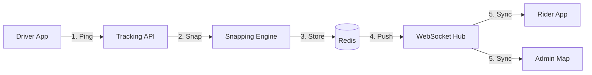

# Tracking Module

The Tracking module manages the ingestion, smoothing, and broadcasting of GPS coordinates.

## Data Ingest Loop

## Technical Shortcuts

| Category | Documentation Link |
| :--- | :--- |
| Processing | [Smoothing](./4.Core_Logic/Smoothing.md) \| [Geo Processing](./4.Core_Logic/Geo_Processing.md) |
| Streaming | [WebSockets](./4.Core_Logic/Location_Streaming.md) \| [Live Feed](./5.Workflows/Live_Tracking.md) |
| Resilience | [GPS Drift](./6.Edge_Cases/GPS_Drift.md) \| [Signal Loss](./6.Edge_Cases/GPS_Drift.md) |
| Database | [Models](./3.Database/Models.md) \| [API catalog](./2.API/Endpoints.md) |

## Key Pillars

### Snap-to-Route
Coordinates are forced onto the planned route polyline, ensuring smooth vehicle movement for the rider.

### Sub-Second Latency
Redis Channels and optimized workers achieve <200ms latency from phone ping to map update.

### Deviation Guard
The system monitors distance from the planned route and raises alerts if a driver deviates by more than 500m.

## Module Navigation
- [Models](./3.Database/Models.md)
- [API Endpoints](./2.API/Endpoints.md)
- [Snapping Details](./4.Core_Logic/Smoothing.md)
