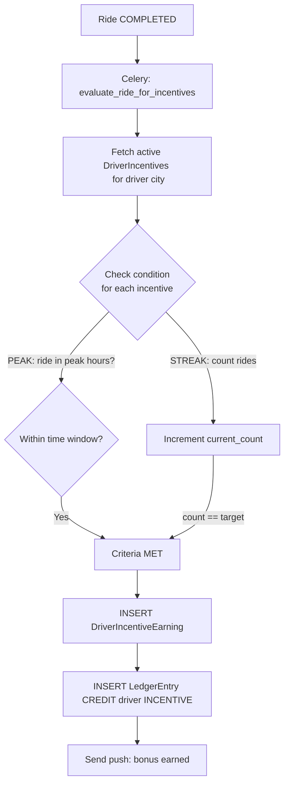

# Workflow: Incentive Completion & Payout

The Incentive Completion workflow is an asynchronous reversal sequence that ensures drivers are rewarded for following specific behavioral rules (like streaks or peak hours).

## The Incentive Sequence

### 1. Trigger initiation
- A ride enters the `COMPLETED` status.
- A Celery task (`evaluate_ride_for_incentives`) is queued for immediate execution.

### 2. Condition Validation
- The **Incentive Engine**:
- Retrieves all currently active `DriverIncentive` rules for the driver's current city.
- Checks each rule's `condition` (e.g., peak hours, minimum rating, distance threshold).
- **Streak Check**: Finds existing `DriverIncentiveProgress` or creates a new one.

### 3. Progress Update
- For **STREAK** incentives: `current_count` is incremented.
- For **PEAK** incentives: The system checks if the ride happened in the specific time window.

### 4. Threshold & Completion
- If the `condition` is met (e.g. `current_count == 5`):
- **Final State**: `DriverIncentiveProgress` is marked as completed.
- **Earning Recode**: A new `DriverIncentiveEarning` record is created to track the ride and the bonus amount.

### 5. Final Settlement
- **Internal Ledger**: A `LedgerEntry` (CREDIT) for the bonus amount is inserted for the driver with reason `INCENTIVE`.
- **Broadcast**:
- Rider receives a push notification and an in-app animation ("Streak Complete!").
- The **Earnings Screen** is updated to include the new bonus.

## The Driver Experience

While of an active streak:
- **Progress Tracker**: The driver app shows a"3 / 5 Rides"card on the main dashboard.
- **Live Feedback**: Every ride completion provides a"1 More to Bonus"notification.

## Atomic Transactions (Reliability)

The system uses `transaction.atomic()` for all increment and settlement steps. This ensures that the incentive is **only** awarded if the database transaction that recorded the final ride and the ledger debit/credits is successfully committed.
---

## Flow Diagram

