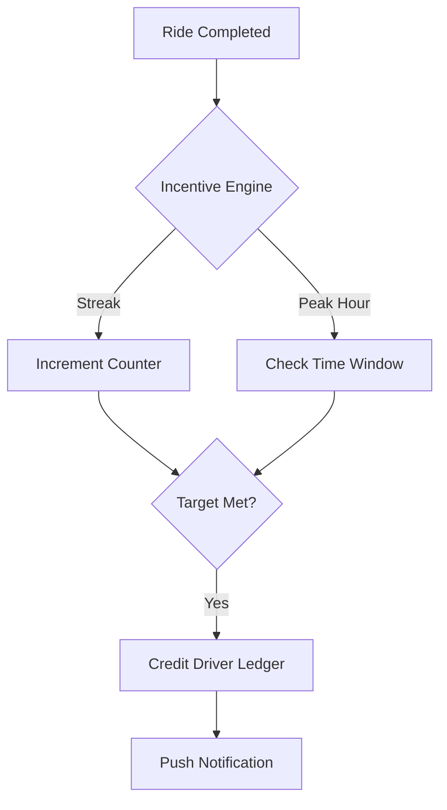

# Driver Incentives Module

The Driver Incentives module is designed to boost driver platform engagement and reliability through strategic bonus structures, streak rewards, and peak-hour incentives.

## Directory Structure

- [**0. Overview**](./0.Overview/Introduction.md): High-level introduction to the driver incentive and gamification system.
- [**1. Architecture**](./1.Architecture/System_Design.md): System design, incentive types, and asynchronous progress tracking.
- [**2. API**](./2.API/Endpoints.md): API endpoints for listing active incentives and tracking personal progress.
- [**3. Database**](./3.Database/Models.md): Deep dive into `DriverIncentive`, `DriverIncentiveProgress`, and `DriverIncentiveEarning`.
- [**4. Core Logic**](./4.Core_Logic/Incentive_Engine.md): Central logic for evaluating and applying incentive bonuses.
- [**5. Workflows**](./5.Workflows/Incentive_Flow.md): Step-by-step sequence from ride completion to bonus payout.
- [**6. Edge Cases**](./6.Edge_Cases/Budget_Limit.md): Handling budget caps, expiration, and multi-incentive collisions.

## Key Features

- **Multi-Incentive Types**: Built-in support for Streaks (N-rides), Peak Hour bonuses, and Geo-Zone incentives.
- **Real-time Progress Tracking**: Drivers can see their live"Streak"progress in the app after every ride completion.
- **Dynamic Configuration**: Admins can configure incentive rules (e.g.,"5 rides between 5 PM and 8 PM") via a flexible JSON condition field.
- **Automated Payouts**: Bonuses are automatically calculated and credited to the driver's internal ledger upon meeting the criteria.
- **City-Specific Sharding**: Incentives can be targeted to specific cities or regions to manage local supply and demand imbalances.
