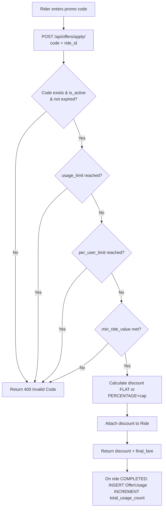

# Workflow: Code Application & Discount Payout

The Offer Application workflow is an asynchronous sequence designed to deliver real-time promotional discounts to riders and ensure economic integrity.

## The Offer Sequence

### 1. Request Initiation (`POST /api/offers/apply/`)
- Rider enters a promo code (e.g. `UBERNEW50`) during ride booking.
- **Backend**: 
- Calculates the estimated fare (`base_fare`).
- Calls the **Eligibility Layer** to verify code validity, usage history, and city targeting.
- **Response**: Calculated `discount_applied` and the `final_estimated_fare`.

### 2. Validation Stage (Low Latency)
- **Code Lookup**: Fetches the `Offer` record from the database.
- **Checks**: `is_active`, `valid_to`, `usage_limit`, `per_user_limit`.
- **Calculation**:
- **FLAT**: `discount = value`.
- **PERCENTAGE**: `discount = min(base_fare * (value / 100), max_discount)`.

### 3. Ride Assignment
- If valid, the discount is attached to the `Ride` model (`applied_offer`).
- The **Rides** module tracks this until the ride is finished.

### 4. Completion & Consumption
- Once the ride enters the `COMPLETED` status:
- A `OfferUsage` record is created to track the final discount.
- The `total_usage_count` on the `Offer` is incremented.
- The final `fare_payout` calculation logic subtracts the discount.

### 5. Final Settlement
- **Internal Ledger**: A `LedgerEntry` (DEBIT) for the ride fare (minus the discount) is recorded for the rider.
- **Platform Expense**: A corresponding `LedgerEntry` (DEBIT) for the platform's promo-spend is inserted (if applicable).

## The Rider Experience

While applying a code:
- **Verification Alert**: If the code is invalid, an error message is immediately returned to the app.
- **Applied Banner**: If valid, the app shows the discount and the updated `final_fare`.
- **Payment Receipt**: The final bill clearly shows the `PROMO_DISCOUNT` and the net amount paid.

## Atomic Transactions (Reliability)

Every set of related usage updates and ledger entries is wrapped in a **Postgres Transaction** (`transaction.atomic()`). If the ride completion fails, the usage increment is also rolled back, ensuring no"Shadow Usage"occurs.
---

## Flow Diagram

