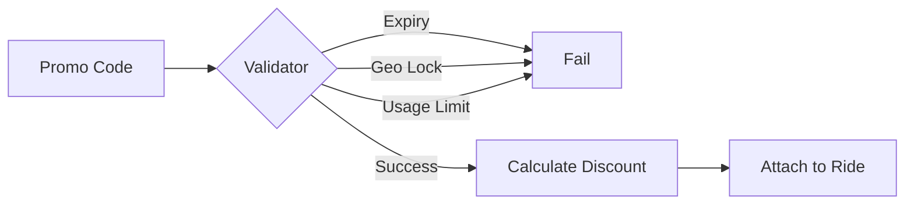

# Offers & Promotions Module

The Offers module manages the creation, validation, and application of promotional codes and discounts for riders, helping drive platform growth and retention.

## Directory Structure

- [**0. Overview**](./0.Overview/Introduction.md): High-level introduction to the promotional offering system.
- [**1. Architecture**](./1.Architecture/System_Design.md): System design, discount types, and validation logic.
- [**2. API**](./2.API/Endpoints.md): API endpoints for listing available offers and applying promo codes.
- [**3. Database**](./3.Database/Models.md): Deep dive into the `Offer` and `OfferUsage` models.
- [**4. Core Logic**](./4.Core_Logic/Offer_Engine.md): Central engine for calculating discounts and verifying eligibility.
- [**5. Workflows**](./5.Workflows/Offer_Application.md): Step-by-step sequence of applying an offer to a ride booking.
- [**6. Edge Cases**](./6.Edge_Cases/Invalid_Code.md): Handling expired codes, usage limits, and region-locked offers.

## Key Features

- **Flexible Discount Types**: Support for both Flat (e.g., ₹50 off) and Percentage (e.g., 20% off) discounts.
- **Granular Constraints**: Configurable usage limits, per-user limits, and minimum ride value requirements.
- **Time & City Targeting**: Offers can be scheduled with validity dates and locked to specific operating cities.
- **Automated Usage Tracking**: Real-time counter increments and user-specific usage tracking.
- **Capped Percentage Discounts**: Limit the maximum discount amount for percentage-based offers to maintain unit economics.
