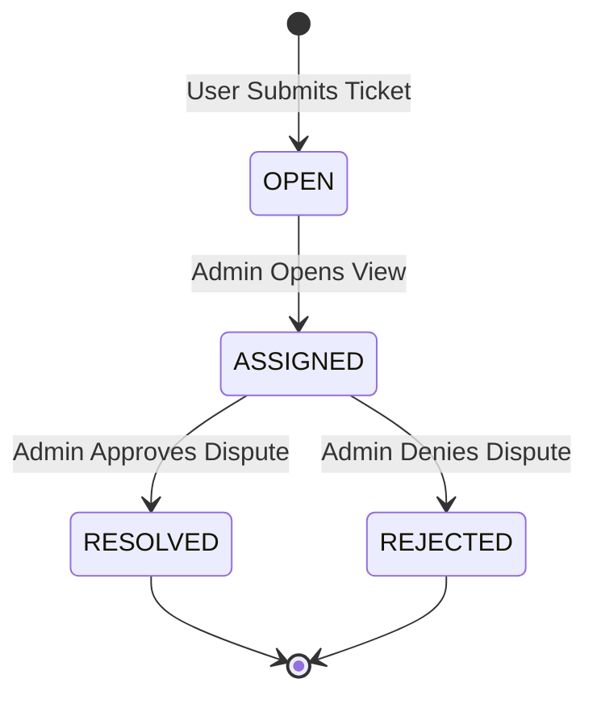

# Ticket System Logic

The `SupportTicket` system is the authoritative, asynchronous handling layer for user inquiries and ride-related disputes on the Uber Clone platform.

## The Ticket Management Principles

The system follows a set of strict rules for financial and service reporting:

1. **Context-First Resolution**: Every ticket is linked to a `RideID`, allowing admins to instantly see the fare, driver, rider, and route history without searching.
2. **State Immortality**: Once a ticket is resolved or rejected, its `status`, `resolved_by`, and `resolution_note` are fixed and audited.
3. **Audit Compliance**: All resolution notes and timestamps are persistently stored for platform integrity and potential legal or financial review.

## How Resolution Workflows are Handled

Support items follow a clear **State Machine**:

- **`OPEN`**: The initial state when a user submits a request.
- **`RESOLVED` (Success)**: 
- The Admin agrees with the user's inquiry (e.g. overcharged).
- A `resolution_note` is recorded explaining the action.
- The user is notified via push notification.
- **`REJECTED` (Finality)**: 
- The Admin disagrees with the user's inquiry (e.g. invalid misconduct report).
- A `resolution_note` is still recorded for transparency.

## The User Experience (Ticket Flow)

Upon issue reporting (`POST /api/support/tickets/`):
1. **Submission**: User provides a `reason` and `description`.
2. **Creation**: A `SupportTicket` record is created (`status: OPEN`).
3. **Review**: An Admin picks up the ticket from their dashboard.
4. **Finality**: The Admin calls the `resolve()` or `reject()` method on the model.

## Atomic Transitions (Database Integrity)

The system uses `save(update_fields=[...])` for both `resolve` and `reject` calls. This ensures that only the relevant administrative and state fields are modified, preventing accidental side effects on the user-reported data.

## Future Enhancements

- **Automated Refunds**: Integrating with the [**Payments module**](../../4.Payments/4.Core_Logic/Refund_System.md) to automatically trigger a partial refund if a ticket is resolved with the `OVERCHARGED` reason.
- **Ticket SLAs**: Background tasks that flag tickets as"Delayed"if they have been `OPEN` for more than 48 hours.

---

## Flow Diagram

