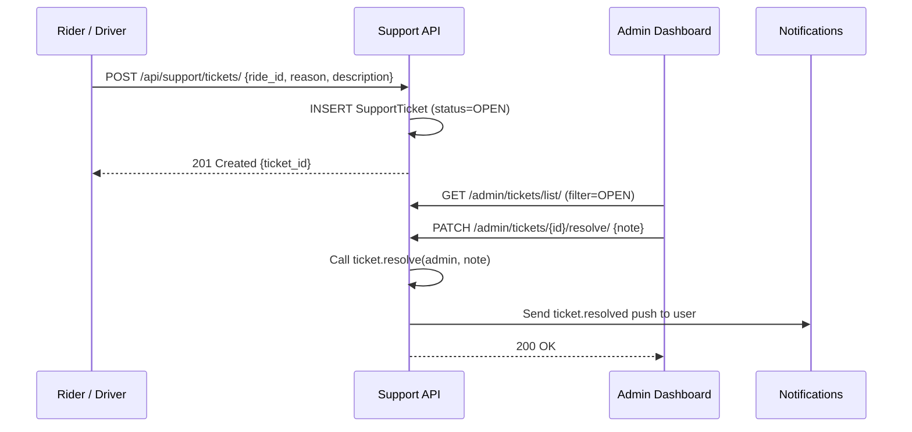

# Workflow: Issue Reporting & Resolution

The Support Issue workflow is an asynchronous sequence designed to handle user inquiries and disputes fairly and transparently.

## The Support Sequence

### 1. Request Initiation (`POST /api/support/tickets/`)
- User (Rider or Driver) submits a support ticket (e.g. `reason: OVERCHARGED`).
- **Backend**: 
- Validates the `ride_id` context.
- Creates a `SupportTicket` record with `status: OPEN`.
- **Response**: `ticket_id` is sent to the user's mobile app.

### 2. Admin Review (Asynchronous)
- Support Team member picks up the `OPEN` ticket from their dashboard.
- **Backend**: 
- Displays all ride metadata (fare, path, driver/rider IDs).
- Admins provide a `resolution_note`.
- **Action**: Admin calls the `resolve()` or `reject()` method on the model.

### 3. Terminal State (Success/Failure)
- **Resolve (Success)**:
- `status` set to `RESOLVED`.
- **Notification**: The user receives a `TICKET_RESOLVED` push notification.
- An automated refund or credit may be triggered (optional).
- **Reject (Finality)**:
- `status` set to `REJECTED`.
- **Notification**: The user receives a `TICKET_CLOSED` push notification.
- Detailed explanation is provided in the `resolution_note`.

## The User Experience

While of a support inquiry:
- **Portal Status**: The user's"Help"or"Support History"screen shows existing tickets as"Open"or"Resolved".
- **In-app Alert**: Upon resolution, a push notification provides immediate feedback.
- **Context-Aware Help**: When a rider views a completed ride, a"Report an Issue"button is available to pre-fill the ticket with the correct `ride_id`.

## Atomic Transitions (Reliability)

The system uses `save(update_fields=[...])` for both `resolve` and `reject` calls. This ensures that only relevant administrative and state fields are modified, preventing accidental side effects on user-reported data.
---

## Flow Diagram

