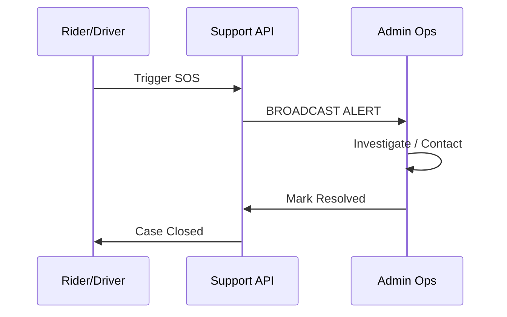

# Support Module

The Support module provides the essential safety and assistance layer of the Uber Clone, managing user inquiries, ride-related disputes, and real-time emergency (SOS) alerts.

## Directory Structure

- [**0. Overview**](./0.Overview/Introduction.md): High-level introduction to the support and safety ecosystem.
- [**1. Architecture**](./1.Architecture/System_Design.md): System design, ticket lifecycle, and emergency broadcast logic.
- [**2. API**](./2.API/Endpoints.md): API endpoints for creating tickets, triggering SOS, and fetching FAQs.
- [**3. Database**](./3.Database/Models.md): Deep dive into `SupportTicket`, `Emergency`, and `FAQ` models.
- [**4. Core Logic**](./4.Core_Logic/Ticket_System.md):
- [Ticket System](./4.Core_Logic/Ticket_System.md)
- [Emergency (SOS) System](./4.Core_Logic/Emergency.md)
- [**5. Workflows**](./5.Workflows/Support_Flow.md): Step-by-step sequence from issue reporting to resolution.
- [**6. Edge Cases**](./6.Edge_Cases/Escalation.md): Handling unresponsiveness, false SOS alarms, and high-priority escalation.

## Key Features

- **Ride-Linked Tickets**: Every support request is linked to a specific ride ID for immediate context and faster resolution.
- **Real-time SOS Signaling**: Integrated emergency system that captures GPS coordinates and ride state at the exact moment of an alert.
- **Categorized FAQs**: Self-service knowledge base tailored specifically for riders and drivers.
- **Admin Resolution Workflow**: Clear state management (`OPEN`, `RESOLVED`, `REJECTED`) for all support items.
- **Audit Compliance**: Persistent storage of resolution notes and timestamps for all closed tickets and emergencies.
